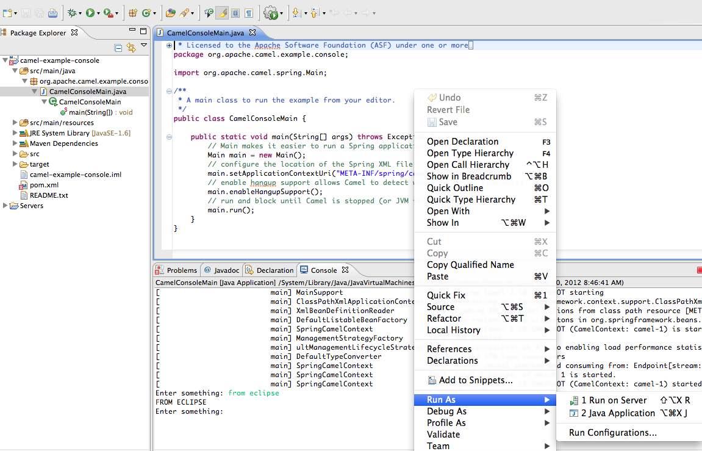

[[ConfluenceContent]]
[[ConsoleExample-ConsoleExample]]
Console Example
~~~~~~~~~~~~~~~

*Available as of Camel 2.10*

This example is located in the link:download.html[Camel distribution] at
`examples/camel-example-console`.

This is a beginner's example that demonstrates how to get started with
Apache Camel.

In this example we integrate with the console using the
link:stream.html[Stream] component. The example is interactive - it
reads input from the console, and then transforms the input to upper
case and prints it back to the console.

This is implemented with a Camel route defined in the Spring XML markup
shown below:

\{snippet:id=e1|lang=xml|url=camel/trunk/examples/camel-example-console/src/main/resources/META-INF/spring/camel-context.xml}

This example can be launched from the command line using Maven:

mvn compile exec:java

In the console you can enter a message and press <ENTER>. Camel responds
by echoing the input message in upper case, as shown below:

[onsole.CamelConsoleMain.main()] SpringCamelContext INFO Apache Camel
2.10 (CamelContext: camel-1) started in 0.455 seconds Enter something:
camel rocks CAMEL ROCKS Enter something: and we have fun AND WE HAVE FUN
Enter something:

To stop the example, strike Control+C

You can also run this example from your editor. For example, from
Eclipse you can import this project using: File → Import … → Existing
Maven Project, and select `pom.xml` from the
`examples\camel-example-console` directory.

Next, navigate to the
`org.apache.camel.example.console.CamelConsoleMain` class, right-click,
and select Run As → Java Application.

Click on the screenshot below, to make it bigger.

[[ConsoleExample-Seealso]]
See also
^^^^^^^^

* link:stream.html[Stream]
* link:examples.html[Examples]
* link:tutorials.html[Tutorials]
* link:user-guide.html[User Guide]
