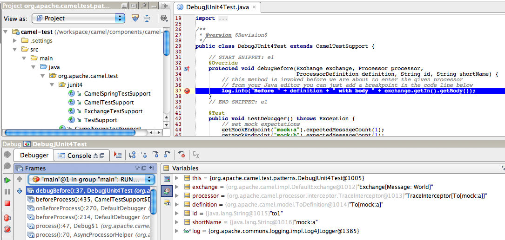

[[ConfluenceContent]]
[[Debugger-Debugger]]
Debugger
~~~~~~~~

*Available as of Camel 2.6*

Camel link:debugger.html[Debugger] is much related to
link:tracer.html[Tracer], in fact they are sisters. Debugger is a
enhanced tracer with a debugger framework so that tooling can be
developed to easily monitor Camel routes, trace messages and set
breakpoints at points in a route etc.

There is also a link:backlogdebugger.html[BacklogDebugger] which allows
to debug from JMX, and 3rd party tooling.

[[Debugger-AbouttheDebugger]]
About the Debugger
^^^^^^^^^^^^^^^^^^

The Debugger allows tooling or the likes to attach breakpoints which is
being invoked when link:exchange.html[Exchange]s are being routed.

[[Debugger-DefaultImplementation]]
Default Implementation
^^^^^^^^^^^^^^^^^^^^^^

Camel provides a default implementation
*`org.apache.camel.impl.DefaultDebugger`* which you can set on the
*`CamelContext`* using the *`setDebugger`* method. Likewise you can get
hold of the link:debugger.html[Debugger] using the *`getDebugger`*
method on *`CamelContext`*.

The *`org.apache.camel.spi.Debugger`* has methods to attach and remove
breakpoints. And to suspend/resume all breakpoints etc. You can also
attach a condition to the breakpoint so it only reacts if the condition
matches.

[[Debugger-DebuggingCamelRoutesUsingcamel-test]]
Debugging Camel Routes Using `camel-test`
^^^^^^^^^^^^^^^^^^^^^^^^^^^^^^^^^^^^^^^^^

If you are developing unit tests using the *`camel-test`* component,
then the link:debugger.html[Debugger] comes out of the box. From *Camel
2.9*: you would need to explicit enable the debugger, by overriding
*`isUseDebugger()`* method and return *`true`*.

[[Debugger-Example]]
Example
+++++++

In this unit test

public class DebugTest extends CamelTestSupport

We want to debug the following
route:\{snippet:id=e2|lang=java|url=camel/trunk/components/camel-test/src/test/java/org/apache/camel/test/patterns/DebugTest.java}Which
can easily done by overriding the *`debugBefore`* method as
shown:\{snippet:id=e1|lang=java|url=camel/trunk/components/camel-test/src/test/java/org/apache/camel/test/patterns/DebugTest.java}Then
from your Java editor just add a breakpoint inside the *`debugBefore`*
method. Then fire up the unit test and wait for the Java editor to hit
the breakpoint. Then you can inspect the link:exchange.html[Exchange]
during debugging while it advances during routing. The
*`ProcessorDefinition`* and the *`id`* and *`shortName`* parameters is
all information which tells you where in the route the breakpoint was
hit.

There is also a *`debugAfter`* method which is invoked after the
processor has been invoked. This allows you to _see_ what happens to the
link:exchange.html[Exchange] right after it has invoked a processor in
the route.

The screenshot below shows the link:debugger.html[Debugger] in action.
The IDE (IDEA) has hit the breakpoint and we can inspect the parameters.
Notice how we can see that the message is to be send to the *`mock:a`*
endpoint:

[[Debugger-SeeAlso]]
See Also
^^^^^^^^

* link:tracer.html[Tracer]
* link:backlogdebugger.html[BacklogDebugger]
