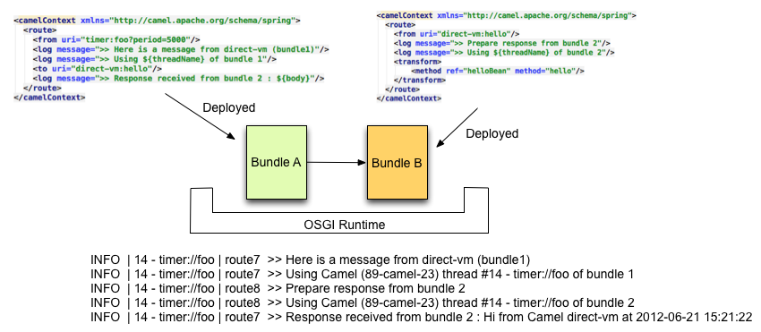

[[ConfluenceContent]]
[[Direct-VM-DirectVMComponent]]
Direct VM Component
~~~~~~~~~~~~~~~~~~~

*Available as of Camel 2.10*

The *direct-vm:* component provides direct, synchronous invocation of
any consumers in the JVM when a producer sends a message exchange. +
This endpoint can be used to connect existing routes in the same camel
context, as well from other camel contexts in the *same* JVM.

This component differs from the link:direct.html[Direct] component in
that link:direct-vm.html[Direct-VM] supports communication across
CamelContext instances - so you can use this mechanism to communicate
across web applications (provided that camel-core.jar is on the
system/boot classpath).

At runtime you can swap in new consumers, by stopping the existing
consumer(s) and start new consumers. +
But at any given time there can be at most only one active consumer for
a given endpoint.

This component allows also to connect routes deployed in different OSGI
Bundles as you can see here after. Even if they are running in different
bundles, the camel routes will use +
the same thread. That autorises to develop applications using
Transactions - Tx.

[[Direct-VM-URIformat]]
URI format
^^^^^^^^^^

[source,brush:,java;,gutter:,false;,theme:,Default]
----
direct-vm:someName
----

Where *someName* can be any string to uniquely identify the endpoint

[[Direct-VM-Options]]
Options
^^^^^^^

[width="100%",cols="34%,33%,33%",options="header",]
|=======================================================================
|Name |Default Value |Description
|`block` |`false` |*Camel 2.11.1:* If sending a message to a direct
endpoint which has no active consumer, then we can tell the producer to
block and wait for the consumer to become active.

|`timeout` |`30000` |*Camel 2.11.1:* The timeout value to use if block
is enabled.

|`failIfNoConsumers` |true |*Camel 2.16.0*: Indicates whether the
producer should fail by throwing an exception when sending to a
DIRECT-VM endpoint with no active consumers.
|=======================================================================

[[Direct-VM-Samples]]
Samples
^^^^^^^

In the route below we use the direct component to link the two routes
together:

[source,brush:,java;,gutter:,false;,theme:,Default]
----
from("activemq:queue:order.in")
    .to("bean:orderServer?method=validate")
    .to("direct-vm:processOrder");
----

And now in another CamelContext, such as another OSGi bundle

[source,brush:,java;,gutter:,false;,theme:,Default]
----
from("direct-vm:processOrder")
    .to("bean:orderService?method=process")
    .to("activemq:queue:order.out");
----

And the sample using spring DSL:

[source,brush:,java;,gutter:,false;,theme:,Default]
----
   <route>
     <from uri="activemq:queue:order.in"/>
     <to uri="bean:orderService?method=validate"/>
     <to uri="direct-vm:processOrder"/>
  </route>

  <route>
     <from uri="direct-vm:processOrder"/>
     <to uri="bean:orderService?method=process"/>
     <to uri="activemq:queue:order.out"/>
  </route>    
----

[[Direct-VM-SeeAlso]]
See Also
^^^^^^^^

* link:configuring-camel.html[Configuring Camel]
* link:component.html[Component]
* link:endpoint.html[Endpoint]
* link:getting-started.html[Getting Started]

* link:direct.html[Direct]
* link:seda.html[SEDA]
* link:vm.html[VM]
