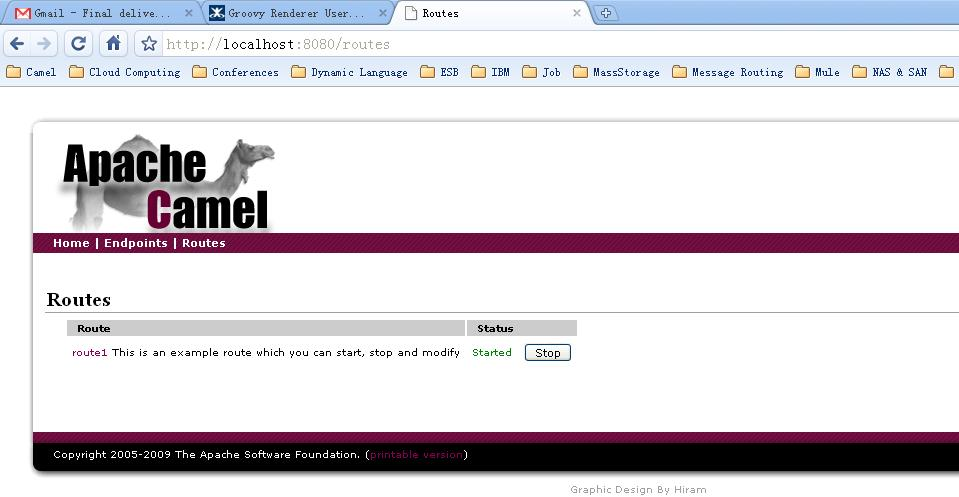
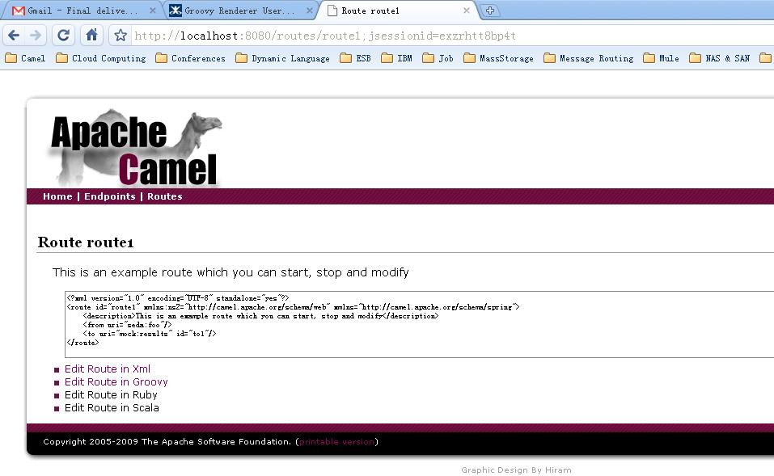
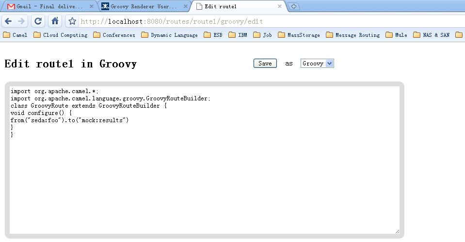

[[ConfluenceContent]]
[[GroovyRendererUserGuide-GroovyRendererUserGuide]]
Groovy Renderer User Guide
~~~~~~~~~~~~~~~~~~~~~~~~~~

This page presents how to editing the route definition in groovy
language through the link:web-console.html[Web Console] and which
link:dsl.html[DSLs] have beensupported currently.

[[GroovyRendererUserGuide-WhatisGroovyRenderer]]
What is Groovy Renderer
^^^^^^^^^^^^^^^^^^^^^^^

Groovy Renderer is a component, which can translate a route instance in
link:camelcontext.html[CamelContext] into a route builder in groovy
language. By using it, link:web-console.html[Web Console] allows
developers disliking prolix XML to edit or update a route using groovy.

[[GroovyRendererUserGuide-GettingStarted]]
Getting Started
^^^^^^^^^^^^^^^

Through link:web-console.html[Web Console], you can review every route
in the link:camelcontext.html[CamelContext]. After opening a route in
your browser, the URL may be http://localhost:8080/routes/route1, you
can choose the edit link with groovy to update it. A groovy renderer
will turn the route into groovy route definition. For example, after
chooseing to edit a route defined by the following XML:

[source,brush:,java;,gutter:,false;,theme:,Default]
----
<?xml version="1.0" encoding="UTF-8" standalone="yes"?>
<route id="route1" xmlns:ns2="http://camel.apache.org/schema/web" xmlns="http://camel.apache.org/schema/spring">
  <description>This is an example route which you can start, stop and modify</description>
  <from uri="seda:foo"/>
  <to uri="mock:results" id="to1"/>
</route>
----

The groovy renderer will translate it into a route definition as
follows:

[source,brush:,java;,gutter:,false;,theme:,Default]
----
import org.apache.camel.language.groovy.GroovyRouteBuilder;
class GroovyRoute extends GroovyRouteBuilder {
  void configure() {
    from("seda:foo").to("mock:results")
  }
}
----

Then you can update the route by input DSLs into the configure method.
For example, you can change it into a
link:content-based-router.html[Content Based Router] by updating it as
follows.

[source,brush:,java;,gutter:,false;,theme:,Default]
----
import org.apache.camel.language.groovy.GroovyRouteBuilder;
class GroovyRoute extends GroovyRouteBuilder { 
  void configure() {    
    from("seda:a").choice().when(header("foo").isEqualTo("bar")).to("seda:b")
      .when(header("foo").isEqualTo("cheese")).to("seda:c").otherwise().to("seda:d")
  }
}
----

Save it and then the route will deliver the following messages by
parsing its header.

[[GroovyRendererUserGuide-APIinGroovyRenderer]]
API in Groovy Renderer
^^^^^^^^^^^^^^^^^^^^^^

[[GroovyRendererUserGuide-renderRoute]]
renderRoute
+++++++++++

RenderRoute handles a route at a time. You can use it to revert a route
for review or modification.

[[GroovyRendererUserGuide-renderRoutes]]
renderRoutes
++++++++++++

RenderRoutes can handle a collection of routes at a time. You can obtain
the route list from link:camelcontext.html[CamelContext] and then get a
overview of all the route definitions by using renderRoutes method.

[[GroovyRendererUserGuide-WebConsoleEditor]]
Web Console Editor
^^^^^^^^^^^^^^^^^^

Through link:web-console.html[Web Console], you can view and edit the
route. The following page lists all the routes configured in
https://cwiki.apache.org/confluence/pages/createpage.action?spaceKey=CAMEL&title=Camel+Context&linkCreation=true&fromPageId=2326785[Camel
Context]. +
 +
By clicking the route id, you are redirected to the route view page. On
this page, XML configuration is presented for view, and you can edit the
route in XML or groovy. +
 +
Following gives the route editor page. You can edit the route in XML or
groovy in current version. +

[[GroovyRendererUserGuide-GuideformoreDSLs]]
Guide for more link:dsl.html[DSLs]
^^^^^^^^^^^^^^^^^^^^^^^^^^^^^^^^^^

link:web-console.html[Web Console] focuses on providing a editor for
developers to update a route at runtime, but won't try to provide a
development environment with full support of DSLs. Groovy renderer can't
render every details of the DSLs when opening a route though all of the
DSLs can be accepted when creating it. Following is a list showing which
DSLs are fully supported and which are not.

[[GroovyRendererUserGuide-SupportedDSLs]]
Supported DSLs
++++++++++++++

* aggregate
* aop
* beanRef
* choice
* convertBody
* deadLetter
* delay
* doTry...doCatch...doFinally
* enrich
* filter
* from
* idempotentConsumer
* intercept
* interceptFrom
* interceptSendToEndpoint
* loadBalance
* loop
* marshal
* onCompletion
* onException
* pipeline
* policy
* pollEnrich: aggregationStrategy can't be supported
* processRef
* recipientList
* removeHeader
* removeProperty
* resequence
* routeSlip
* setBody
* setExchangePattern
* setHeader
* setProperty
* sort
* split
* stop
* threads
* throttle
* to
* transacted
* transform
* wireTap
* xPath

You should read the link:enterprise-integration-patterns.html[Enterprise
Integration Patterns] for usage of these DSLs.

[[GroovyRendererUserGuide-Un-supportedDSLs]]
Un-supported DSLs
+++++++++++++++++

* bean, you may use beanRef instead.
* process, you may use processRef instead.
link:content-based-routing-on-camel.html[Content Based Routing on Camel]
presents how to use the processRef on camel web project. +
link:unsupported-groovy-dsl-features-on-web-console.html[Unsupported
Groovy DSL Features on Web Console] gives a more detailed explaination
on it.

[[GroovyRendererUserGuide-Somesamplesandtutorial]]
Some samples and tutorial
^^^^^^^^^^^^^^^^^^^^^^^^^

link:content-based-routing-on-camel.html[Content Based Routing on
Camel] +
link:load-balance-for-existing-messaging-service.html[Load Balance for
existing Messaging Service] +
You may want to get a bundle of DSLs for quick look on this page:
http://docs.google.com/Doc?docid=0AUJXDyN-cOj2ZGY2ZHJxcWdfMTQwMGhncXB0M2Nn&hl=zh_CN[DSL
samples] +
link:unsupported-groovy-dsl-features-on-web-console.html[Unsupported
Groovy DSL Features on Web Console]
