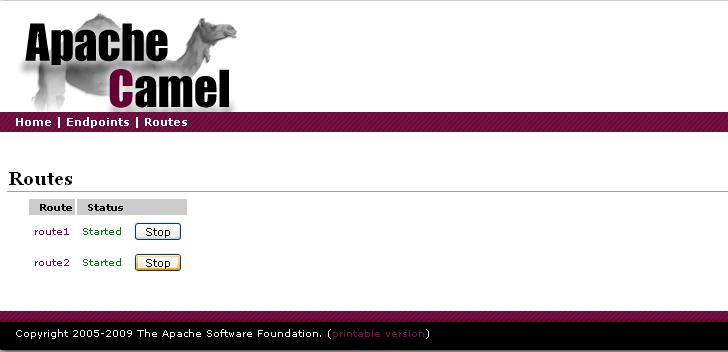
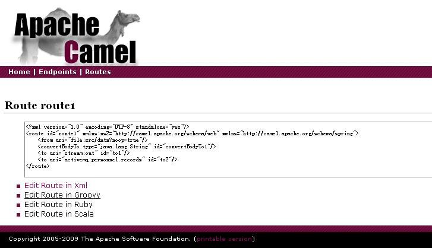

[[ConfluenceContent]]
[[LoadBalanceforexistingMessagingService-LoadBalanceforExistingMessagingService]]
Load Balance for Existing Messaging Service
~~~~~~~~~~~~~~~~~~~~~~~~~~~~~~~~~~~~~~~~~~~

This is a sample to show how we can change our existing messaging
service for requirement or improvement. Here we use a load balance
support as example.

[[LoadBalanceforexistingMessagingService-Buildthesample]]
Build the sample
^^^^^^^^^^^^^^^^

Imagine that we have a message handling system built before to collect
some information from our client and then process and record them. This
scenario can be constructed by using the following XML route
configuration.

[source,brush:,java;,gutter:,false;,theme:,Default]
----
<route>
  <from uri="file:src/data?noop=true"/>
      
  <!-- Print the message to standard out, just as a test -->
  <convertBodyTo type="java.lang.String"/>
  <to uri="stream:out"/> 
      
  <to uri="activemq:personnel.records"/>
</route>

<route>
  <from uri="activemq:personnel.records"/>
  <choice>
     <when>
       <xpath>/person/city = 'London'</xpath>
       <to uri="file:target/messages/uk"/>
     </when>
     <otherwise>
       <to uri="file:target/messages/others"/>
     </otherwise>
  </choice>
 </route>
----

For more instruction to build your sample, read the
link:camel-maven-archetypes.html[Camel Maven Archetypes] page. The above
routes are the default configuration for your new sample, so you can get
started with it easily. +
In this scenario, the first route is responsible to collect data from a
directory: src/data, print it to standard output console and deliver it
to a message queue to further processing. Then, another route get
messages from the queue, and use link:content-based-router.html[Content
Based Router] to sort out them. The messages for person in London are
stored in the directory: target/messages/uk, and others in
target/messages/others. You can run this sample using command:

[source,brush:,java;,gutter:,false;,theme:,Default]
----
mvn jetty:run-war
----

After started, we can view the routes configured in camel context by
directing your browser to http://localhost:8080/routes. +
 +
There are originally several message files in the directory: src/data
and the message system processes them once it is started. We can get the
processing result by checking the console and the files in
target/messages.

[[LoadBalanceforexistingMessagingService-Usetoaddloadbalancesupport]]
Use link:web-console.html[Web Console] to add load balance support
^^^^^^^^^^^^^^^^^^^^^^^^^^^^^^^^^^^^^^^^^^^^^^^^^^^^^^^^^^^^^^^^^^

For a handful of small messages, one queue is enough to handle. But when
encountering high volumn message input, we may want to use several
queues to provide a load balance mechanism. So we can use the camel
link:load-balancer.html[Load Balancer] support. The messaging service
improvement here is much easier than that in other messaging system. You
can open the routes on the above page. +
 +
Use a loadBalance DSL for the message delivery on route1:

[source,brush:,java;,gutter:,false;,theme:,Default]
----
from("file:src/data?noop=true").convertBodyTo(java.lang.String.class).to("stream:out")
  .loadBalance().random()
    .to("activemq:personnel.records1")
    .to("activemq:personnel.records2")
  .end()
----

Let the route2 collect messages from both queues providing the load
balance support:

[source,brush:,java;,gutter:,false;,theme:,Default]
----
from("activemq:personnel.records1", "activemq:personnel.records2")
  .choice()
    .when().xpath("/person/city = 'London'").to("file:target/messages/uk")
    .otherwise().to("file:target/messages/others")
  .end()
----

With these two operations, you have complete this work. Just throw your
message into the directory, camel will process and deliver it
automatically. By the way, you may need some
link:dead-letter-channel.html[Dead Letter Channel] configuration for it
since XML analyzing with rigid format usually accompanies frequent
error.
