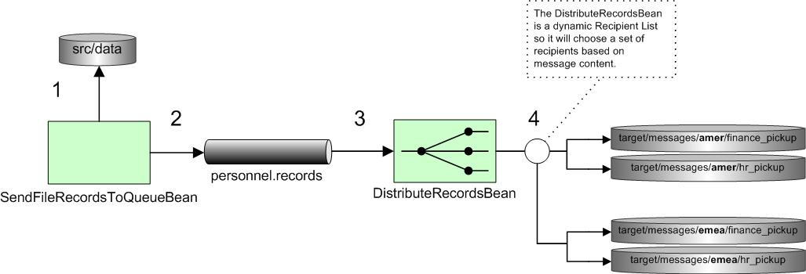

[[ConfluenceContent]]
[[POJOMessagingExample-POJOMessagingExample]]
POJO Messaging Example
~~~~~~~~~~~~~~~~~~~~~~

[[POJOMessagingExample-Introduction]]
Introduction
^^^^^^^^^^^^

This example shows that you don't need to learn Camel's super cool
link:dsl.html[DSL]s if you don't want to. Camel has a set of annotations
that allow you to produce, consume or route messages to endpoints.

[[POJOMessagingExample-Requirements]]
Requirements
^^^^^^^^^^^^

The example is shipped with Camel 2.0, but only requires Camel 1.5 to
run. It also depends on the camel-jms component and
http://activemq.apache.org[Apache ActiveMQ]. Of course, since we are
using Maven these dependencies will be downloaded automatically.

[[POJOMessagingExample-Runningtheexample]]
Running the example
^^^^^^^^^^^^^^^^^^^

The `README.txt` states how to run the example from either Ant or Maven.

Here's how to run it with Maven:

mvn compile camel:run

[[POJOMessagingExample-Whatshappening?]]
Whats happening?
^^^^^^^^^^^^^^^^

When you start the example up you'll see a whole bunch of logs that
won't really mean anything to you
image:https://cwiki.apache.org/confluence/s/en_GB/5997/6f42626d00e36f53fe51440403446ca61552e2a2.1/_/images/icons/emoticons/smile.png[(smile)]
The interesting stuff is happening in the background. Here's a diagram
of whats going on.

At step 1 the `SendFileRecordsToQueueBean` polls the `./src/data`
directory for new files. There are 3 files in this directory so 3
messages will be created. As shown below, the
link:pojo-consuming.html[`@Consume`] annotation will cause any new
messages coming from the `file:src/data endpoint` to be sent to the
`onFileSendToQueue` method.

\{snippet:id=ex|lang=java|url=camel/trunk/examples/camel-example-pojo-messaging/src/main/java/org/apache/camel/example/pojo_messaging/SendFileRecordsToQueueBean.java}

At step 2 the `SendFileRecordsToQueueBean` then sends the contents of
the `File` message as a `String` to the `personnel.records` JMS queue,
which is backed by an embedded instance of Apache ActiveMQ. The
conversion from String to JMS message is automatic. The
link:pojo-producing.html[`@Produce`] annotation is used to access the
link:activemq.html[ActiveMQ] endpoint.

At step 3 the `DistributeRecordsBean` (shown below) consumes the JMS
message from the `personnel.records` queue. Again the
link:pojo-consuming.html[`@Consume`] annotation is used to get messages
from the ActiveMQ endpoint.

\{snippet:id=ex|lang=java|url=camel/trunk/examples/camel-example-pojo-messaging/src/main/java/org/apache/camel/example/pojo_messaging/DistributeRecordsBean.java}

You will notice an additional
link:recipientlist-annotation.html[`@RecipientList`] annotation on the
route method. This turns the method into a
link:recipient-list.html[Recipient List] EIP where the return value is a
list of URIs for the recipients (can be String[], List<String>, URI[],
etc). This annotation is great for creating custom dynamic Recipient
Lists. In this case at step 4 we peek at the city field in the message
(using the link:parameter-binding-annotations.html[`@XPath`] annotation)
and provide a set of recipients based on that. For folk from London,
their files will be sent to file locations for the EMEA region
(`file:target/messages/emea/...`). Others fall into the AMER region
(`file:target/messages/amer/...`).

If you have messages that are not XML, don't fret! Camel has ways to get
information out of arbitrary message payloads. For instance, you can try
using the @Bean annotation to peek at the message using your own Java
bean.

@Consume(uri = "activemq:personnel.records") @RecipientList public
String[] route(@Bean("cityExtractorBean") String city) \{ if
(city.equals("London")) \{

Check out link:parameter-binding-annotations.html[Parameter Binding
Annotations] for more information on this.

After running the example, browse to the `target/messages` directory to
see where the messages were saved.

[[POJOMessagingExample-Seealso]]
See also
^^^^^^^^

* link:bean-integration.html[Bean Integration]
* link:pojo-producing.html[POJO Producing]
* link:pojo-consuming.html[POJO Consuming]
* link:recipientlist-annotation.html[RecipientList Annotation]
* link:recipient-list.html[Recipient List]
* link:parameter-binding-annotations.html[Parameter Binding Annotations]
* link:examples.html[Examples]
* link:tutorials.html[Tutorials]
* link:user-guide.html[User Guide]
