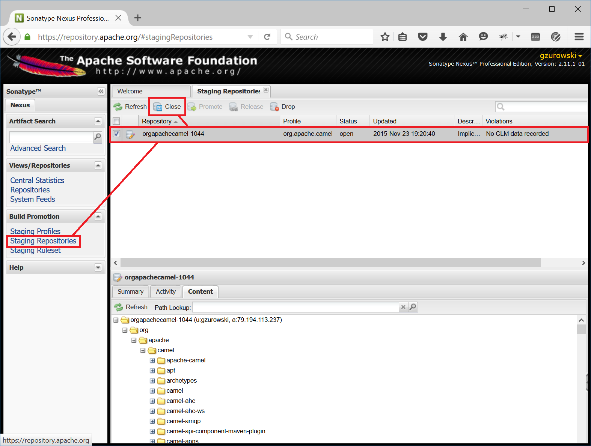

[[ConfluenceContent]]
[[ReleaseGuide-HowtocreateandannounceaCamelrelease.]]
How to create and announce a Camel release.
-------------------------------------------

This release guide is based on the
http://maven.apache.org/developers/release/apache-release.html[General
guide for releasing Maven-based projects at Apache], so be sure to check
it out before continuing and meet all prerequisites.

Prerequisites

To prepare or perform a release you MUST BE at least an Apache Camel
committer.

* The artifacts for each and every release must be SIGNED; your public
key should be added to the KEYS file
* Your public key must also be cross-signed by other Apache committers
(this can be done at key signing parties at ApacheCon for instance)
* Make sure you have the correct maven configuration in
`~/.m2/settings.xml`
* From Camel 2.15 onwards we will require to use Maven [3.1.1,3.2.5)
* From Camel 2.17 onwards we will require to use Maven [3.2.5,3.3.x)
* You may want to get familiar with the release settings in the parent
apache POM.
* Make sure you are using Java 1.8 for Apache Camel 2.18.0 and later
(Java 1.7 for older versions). +
 +

[[ReleaseGuide-Maven2Setup]]
Maven 2 Setup
~~~~~~~~~~~~~

Before you deploy anything to the maven repository using Maven 2, you
should configure your ~/.m2/settings.xml file so that the file
permissions of the deployed artifacts are group writable. If you do not
do this, other developers will not able to overwrite your SNAPSHOT
releases with newer versions. The settings follow the
http://maven.apache.org/developers/committer-settings.html[guidelines]
used by the Maven project. Please pay particular attention to the
http://maven.apache.org/guides/mini/guide-encryption.html[password
encryption recommendations].

[source,brush:,java;,gutter:,false;,theme:,Default]
----
<settings>
  ...
  <servers>
    <!-- Per http://maven.apache.org/developers/committer-settings.html -->

    <!-- To publish a snapshot of some part of Maven -->
    <server>
      <id>apache.snapshots.https</id>
      <username> <!-- YOUR APACHE LDAP USERNAME --> </username>
      <password> <!-- YOUR APACHE LDAP PASSWORD --> </password>
    </server>
    <!-- To publish a website of some part of Maven -->
    <server>
      <id>apache.website</id>
      <username> <!-- YOUR APACHE LDAP USERNAME --> </username>
      <filePermissions>664</filePermissions>
      <directoryPermissions>775</directoryPermissions>
    </server>
    <!-- To stage a release of some part of Maven -->
    <server>
      <id>apache.releases.https</id>
      <username> <!-- YOUR APACHE LDAP USERNAME --> </username>
      <password> <!-- YOUR APACHE LDAP PASSWORD --> </password>
    </server>
    <!-- To stage a website of some part of Maven -->
    <server>
      <id>stagingSite</id> <!-- must match hard-coded repository identifier in site:stage-deploy -->
      <username> <!-- YOUR APACHE LDAP USERNAME --> </username>
      <filePermissions>664</filePermissions>
      <directoryPermissions>775</directoryPermissions>
    </server>

  </servers>
  ...
  <profiles>
    <profile>
      <id>apache-release</id>
      <properties>
        <gpg.useagent>false</gpg.useagent>
        <gpg.passphrase><!-- YOUR GPG PASSPHRASE --></gpg.passphrase>
        <test>false</test>
      </properties>
    </profile>

  </profiles>
...
</settings>
----

It is also essential that you configure your umask to 2 on
people.apache.org for non-interactive login. You can do that by
including the snipped below in your `.profile`.

[source,brush:,text;,gutter:,false;,theme:,Default]
----
umask 002
----

[[ReleaseGuide-CreatingtheCamelRelease]]
Creating the Camel Release
^^^^^^^^^^^^^^^^^^^^^^^^^^

The release plugin will prompt for a release version, tag and next
release version. Use a three digit release version of the form: 2.x.x
and for the tag use a string of the form: camel-2.x.x. The next version
string should use the two digit from: 2.x-SNAPSHOT as this can be
consistent for future SNAPSHOT releases.

1.  Grab the latest source from Git and checkout the target branch to
build from
+
[source,brush:,text;,gutter:,false;,theme:,Default]
----
git clone https://git-wip-us.apache.org/repos/asf/camel.git
cd camel

git checkout BRANCH_NAME   # e.g. BRANCH_NAME = camel-2.16.x
----
2.  Verify headers with
http://creadur.apache.org/rat/apache-rat-plugin/usage.html[rat]
+
[source,brush:,text;,gutter:,false;,theme:,Default]
----
mvn -e org.apache.rat:apache-rat-plugin:check
grep -e ' !?????' target/rat.txt   # will show any files without licenses
----
+
The grep command will return a list of files that don't have correct
license headers. If nothing is returned, you can proceed with the next
step. Otherwise fix the license header in all listed files and invoke
both commands again until no files are returned.
+

Because of http://jira.codehaus.org/browse/MRELEASE-812[MRELEASE-812],
you should use the following setting:

[source,brush:,text;,gutter:,false;,theme:,Default]
----
LANG='en_US.UTF-8'
----
3.  Do a release dry run to check for problems
+
[source,brush:,text;,gutter:,false;,theme:,Default]
----
mvn release:prepare -DdryRun=true -Prelease,apache-release
----
+
Check that you are happy with the results. The poms for the proposed
tags will be in pom.xml.tag. Check also the generated signature files:
+
[source,brush:,text;,gutter:,false;,theme:,Default]
----
cmueller$ gpg camel-core/target/camel-core-2.7.5-SNAPSHOT.jar.asc 
gpg: Signature made Tue Jan 10 20:50:27 2012 CET using RSA key ID 2A239C2C
gpg: Good signature from "Christian Mueller (CODE SIGNING KEY) <cmueller@apache.org>"
----
4.  Prepare the release
+
When you like the results, clean up:
+
[source,brush:,text;,gutter:,false;,theme:,Default]
----
mvn release:clean -Prelease,apache-release
----
+
NOTE: If your git doesn't remember the username and password, you need
pass it to the mvn plugin, otherwise the release plugin will wait
forever. 
+
[source,brush:,text;,gutter:,false;,theme:,Default]
----
mvn release:prepare -Dusername=USERNAME -Dpassword=PASSWORD -Prelease,apache-release
----
+
This will create the tag in svn and leave various stuff around locally
to direct the perform phase.
+

*Note:* If you're located in Europe then release:prepare may fail with
'_Unable to tag SCM_' and '_svn: No such revision X_'. Wait 10 seconds
and run

[source,brush:,text;,gutter:,false;,theme:,Default]
----
mvn release:prepare -Prelease,apache-release
----

again.
5.  Perform the release to the staging repo
+
[source,brush:,text;,gutter:,false;,theme:,Default]
----
mvn release:perform -Prelease,apache-release
----
6.  Close the staging repository +
Quote from the
http://maven.apache.org/developers/release/apache-release.html[Maven
release guide for Apache projects]
+
________________________________________________________________________________________________________________________________________________________________________________________________________________________________________________________________________________________________________________________________________________________________________________________________________________________________________________________________________________________________________________________________________________________________________________________________________________________
Login to https://repository.apache.org using your Apache LDAP
credentials. Click on "Staging Repositories". Then select
"org.apache.camel-xxx" in the list of repositories, where xxx represents
your username and ip. Click "Close" on the tool bar above. This will
close the repository from future deployments and make it available for
others to view. If you are staging multiple releases together, skip this
step until you have staged everything. Enter the name and version of the
artifact being released in the "Description" field and then click
"Close". This will make it easier to identify it later.
________________________________________________________________________________________________________________________________________________________________________________________________________________________________________________________________________________________________________________________________________________________________________________________________________________________________________________________________________________________________________________________________________________________________________________________________________________________
+
See the screenshot below that shows the state of the staging repository
at this stage. +
 +
 +
 +
7.  Verify staged artifacts +
Quote from the
http://maven.apache.org/developers/release/apache-release.html[original
guide]
+
_______________________________________________________________________________________________________________________________________________________________________________________________________________________________________________________________________________________________________________________________________________________________________________________
If you click on your repository, a tree view will appear below. You can
then browse the contents to ensure the artifacts are as you expect them.
Pay particular attention to the existence of *.asc (signature) files. If
the you don't like the content of the repository, right click your
repository and choose "Drop". You can then rollback your release and
repeat the process. +
Note the repository URL, you will need this in your vote email.
_______________________________________________________________________________________________________________________________________________________________________________________________________________________________________________________________________________________________________________________________________________________________________________________

[[ReleaseGuide-TestingtheCamelReleaseCandidate]]
Testing the Camel Release Candidate
~~~~~~~~~~~~~~~~~~~~~~~~~~~~~~~~~~~

When folks need to test out a release candidate, the jars will not have
been uploaded to the central Maven repo. This means that the example
programs which use Maven will not automatically work and you need to
follow the link:testing-a-release-candidate.html[Testing a release
candidate] guidelines. +
Afterwards send out the VOTE for this release candidate to the dev@
mailing list.

[[ReleaseGuide-AnnouncingtheCamelRelease]]
Announcing the Camel Release
~~~~~~~~~~~~~~~~~~~~~~~~~~~~

If the VOTE pass,

1.  Close it by sending the RESULT to the mailing list.
2.  Promote the artifacts to the central repo. For this login to
https://repository.apache.org using your Apache LDAP credentials. Click
on "Staging Repositories". Select "org.apache.camel-xxx" in the list of
repositories, where xxx represents your username and ip. Click "Release"
on the tool bar above. This will promote all artifacts to the central
maven repo. Enter the name and version of the artifact being released in
the "Description" field and then click "Release". This will make it
easier to identify it later.
3.  Perform a
https://issues.apache.org/jira/plugins/servlet/project-config/CAMEL/versions[release
in JIRA] and create a new release version in JIRA
4.  There should be already a release notes page in the
https://cwiki.apache.org/confluence/display/CAMEL/In+Progress[In
Progress] folder (if not create one based on the
https://cwiki.apache.org/confluence/display/CAMEL/Camel%20x.y.z%20Release%20(template)[Camel
x.y.z Release (template)]). Edit it and change the number of fixed
issues, and update its parent to be the
https://cwiki.apache.org/confluence/display/CAMEL/Download[Download]
page, and *make sure* to remove the (release in progress) in the title.
Now would be a good time to create a new release notes page for the next
release based on the template mentioned before. It is useful and simpler
to keep it up to date during the development cycle.
5.  Copy the newly deployed distribution to Apache website:
+
[source,brush:,text;,gutter:,false;,theme:,Default]
----
cd ${CAMEL_ROOT_DIR}/etc/scripts
./release-distro.sh <Camel version>
----
+
The script will download all distribution artifacts using wget and
eventually show the following message:
+
[source,brush:,java;,gutter:,false;,theme:,Default]
----
Distro artifacts prepared for upload, but not yet uploaded. Verify distro then complete upload!
cd /tmp/camel-release/dist/x.y.z/
svn status
svn ci -m "Apache Camel x.y.z released artifacts."
Remove previous distro on same branch if necessary
DONE
----
+
Finish this step by following the provided command sequence using
svn after checking the artifacts.
6.  Remove the old release by using svn:
+
[source,brush:,java;,gutter:,false;,theme:,Default]
----
svn rm https://dist.apache.org/repos/dist/release/camel/apache-camel/OLD_CAMEL_VERSION -m "Removed the old release"
----
7.  Update the download link of
the link:camel-xyz-release-template.html[Camel x.y.z Release] to
with http://archive.apache.org/dist/
8.  Copy the KEYS file by ssh into
/www/www.apache.org/dist/camel/apache-camel/ on people.apache.org *if*
you changed it
9.  Update the
https://cwiki.apache.org/confluence/display/CAMEL/Download[Download]
page to refer to the latest release distributions (search & replace the
version numbers mostly)
10. Upload the newly deployed schema and the manual to Apache:
+
[source,brush:,text;,gutter:,false;,theme:,Default]
----
cd ${CAMEL_ROOT_DIR}/etc/scripts
./release-website.sh <Camel version>
----
+
The script will download the website release artifacts using wget. Once
all artifacts are downloaded, the following message is displayed:
+
[source,brush:,java;,gutter:,false;,theme:,Default]
----
NOTE: Manual steps required! Check the schemas and manual files for new artifacts,
      add them to the repository as required and commit your changes. This step
      is intentionally not automated at this point to avoid errors.

cd /tmp/camel-release/websites/production/camel/x.y.z/schema/
svn status
svn add <schema-x.y.z-qualifier>.xsd
svn ci -m "Uploading released schemas for camel-x.y.z"

cd /tmp/camel-release/websites/production/camel/x.y.z/manual/
svn status
svn add camel-manual-x.y.z.html
svn ci -m "Uploading released manuals for camel-x.y.z"
----
+
Finish this step by following the provided command sequence using svn
after checking the artifacts.
11. Upload the javadocs to Apache, you need to checkout the files from
"https://svn.apache.org/repos/infra/websites/production/camel/content/maven/"
+
**Using SVN the first time on people.apache.org**

To be able to perform a checkout on people.apache.org from
svn.apache.org, you have to trust the server certificate:

....
svn list "https://svn.apache.org/repos/infra/websites/production/camel/content"
Error validating server certificate for 'https://svn.apache.org:443':
   The certificate is not issued by a trusted authority. Use the fingerprint to validate the certificate manually!
Certificate information:
   Hostname: *.apache.org
   Valid: from Tue, 20 Dec 2011 00:00:00 GMT until Mon, 17 Feb 2014 23:59:59 GMT
   Issuer: Thawte, Inc., US
   Fingerprint: bc:5f:40:92:fd:6a:49:aa:f8:b8:35:0d:ed:27:5e:a6:64:c1:7a:1b
(R)eject, accept (t)emporarily or accept (p)ermanently?
....
12. Update the
https://cwiki.apache.org/confluence/display/CAMEL/Xml+Reference[Xml
Reference] page with a link to the XSD's
13. Update the link:manual.html[Manual] page with a link to the PDF/HTML
*if* it's a new major/minor version
14. Mail the dev@camel.apache.org, users@camel.apache.org &
announce@apache.org lists
15. https://cwiki.apache.org/confluence/pages/createblogpost.action?spaceKey=CAMEL[Post]
a news entry in the wiki which *links to the release page* so folks can
download it!
16. perform a full export of the Camel WIKI sites to see your blog on
the Camel index site. To do this, you have to remove the main.pageCache
file in the content/cache sub directory:
1.  execute: svn rm
https://svn.apache.org/repos/infra/websites/production/camel/content/cache/main.pageCache
17. Add the release version number to the following `spring.schemas`
file located in `src/main/resources/META-INF` directory of the following
components:
* camel-cxf
(https://git-wip-us.apache.org/repos/asf?p=camel.git;a=blob;f=components/camel-cxf/src/main/resources/META-INF/spring.schemas;hb=HEAD[/camel/components/camel-cxf/src/main/resources/META-INF/spring.schemas])
* camel-spring
(https://git-wip-us.apache.org/repos/asf?p=camel.git;a=blob;f=components/camel-spring/src/main/resources/META-INF/spring.schemas;hb=HEAD[/camel/components/camel-spring/src/main/resources/META-INF/spring.schemas])
* camel-spring-integration
(https://git-wip-us.apache.org/repos/asf?p=camel.git;a=blob;f=components/camel-spring-integration/src/main/resources/META-INF/spring.schemas;hb=HEAD[/camel/components/camel-spring-integration/src/main/resources/META-INF/spring.schemas])
* camel-spring-security
(https://git-wip-us.apache.org/repos/asf?p=camel.git;a=blob;f=components/camel-spring-security/src/main/resources/META-INF/spring.schemas;hb=HEAD[/camel/components/camel-spring-security/src/main/resources/META-INF/spring.handlers])
18. Have a beer!
image:https://cwiki.apache.org/confluence/s/en_GB/5997/6f42626d00e36f53fe51440403446ca61552e2a2.1/_/images/icons/emoticons/smile.png[(smile)]
