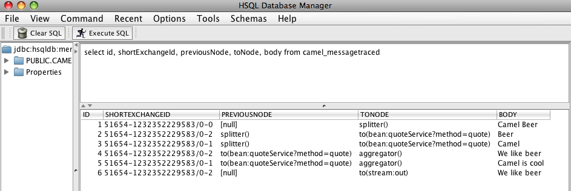
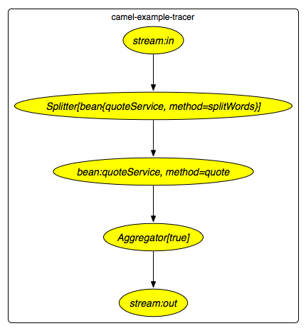

[[ConfluenceContent]]
[[TracerExample-TracerExample]]
Tracer Example
~~~~~~~~~~~~~~

[[TracerExample-Introduction]]
Introduction
^^^^^^^^^^^^

This example demonstrates the link:tracer.html[Tracer].
link:tracer.html[Tracer] is a tracing feature build in camel core to log
snapshots of link:exchange.html[Exchange]s while they are routed. This
allows you to see:

* how a given link:exchange.html[Exchange] was routed
* a snapshot of the content of the link:exchange.html[Exchange] at any
given node it passed in the route

When used Camel will by default log the snapshot at *`INFO`* level. This
example demonstrates how to persist trace snapshots using
link:jpa.html[JPA] into a database. This allows you to store this
information and query them from a SQL prompt, giving you full power to
analyze the data.

[[TracerExample-Requirements]]
Requirements
^^^^^^^^^^^^

This requires Camel 2.0, the *`camel-jpa`* component and configuration
of the target database.

[[TracerExample-DataModel]]
Data Model
^^^^^^^^^^

Camel uses the
*`org.apache.camel.processor.interceptor.JpaTraceEventMessage`* JPA
@Entity as data model. This class has been enhanced with
link:jpa.html[JPA] annotations.

The class has the following properties in the link:jpa.html[JPA] model:

[width="100%",cols="34%,33%,33%",options="header",]
|=======================================================================
|Property |Type |Description
|`Body` |`String` |The link:exchange.html[Exchange] *`IN`* body dumped
as a *`String`*.

|`BodyType` |`String` |The link:exchange.html[Exchange] *`IN`* body java
type such as *`String`*, *`org.w3c.Document`*, *`com.mycompany.MyOrder`*
etc.

|`CausedByException` |`String` |The link:exchange.html[Exchange]
exception (if any) dumped as a String including stacktrace.

|`ExchangeId` |`String` |Unique id of the link:exchange.html[Exchange.]

|`ExchangePattern` |`String` |The link:exchange-pattern.html[Exchange
Pattern] such as *`InOnly`* or *`InOut`*.

|`FromEndpoint` |`String` |the URI of the starting consumer the
link:exchange.html[Exchange] was created (usually a from in the route).

|`Headers` |`String` |The link:exchange.html[Exchange] *`IN`* headers
dumped as a *`String`*.

|`Id` |`Long` |Primary key that is generated by the database.

|`OutBody` |`String` |The link:exchange.html[Exchange] *`OUT`* body (if
any) dumped as a *`String`*.

|`OutBodyType` |`String` |The link:exchange.html[Exchange] *`OUT`* body
(if any) java type such as *`String`*,
*`org.w3c.Document`*, *`com.mycompany.MyOrder`* etc.

|`OutHeaders` |`String` |The link:exchange.html[Exchange] *`OUT`* (if
any) headers dumped as a *`String`*.

|`PreviousNode` |`String` |*`id`* of the previous step in the route. Is
*`null`* if there wasn't a previous node such as the start.

|`Properties` |`String` |The link:exchange.html[Exchange] properties
dumped as a *`String`*.

|`ShortExchangeId` |`String` |*`id`* of the link:exchange.html[Exchange]
without the machine name.

|`Timestamp` |`Date` |Timestamp when the snapshot was generated. Is the
system time of the JMV in which Camel is running.

|`ToNode` |`String` |*`id`* of the next step in the route.
|=======================================================================

The table name for persisting trace events is: *`CAMEL_MESSAGETRACED`*

[[TracerExample-Configurationofthedatabase]]
Configuration of the database
^^^^^^^^^^^^^^^^^^^^^^^^^^^^^

The link:tracer.html[Tracer] uses standard link:jpa.html[JPA]
configuration for setting the database. In
the *`META-INF/persistence.xml`* file we setup the service unit and the
database configuration
as:\{snippet:id=e1|lang=xml|url=camel/trunk/examples/camel-example-tracer/src/main/resources/META-INF/persistence.xml}What
is important is to add the *`JpaTraceEventMessage`* as a class in the
*`persistence.xml`* file to register our data model:

xml<class>org.apache.camel.processor.interceptor.JpaTraceEventMessage</class>

In this example we use Hibernate JPA and a HSQLDB as database.

[[TracerExample-RunningtheExample]]
Running the Example
^^^^^^^^^^^^^^^^^^^

The *`README.txt`* states how to run the example from either ANT or
Maven.

Here we show running with Maven:

mvn camel:run

When the application starts it start:

* in the console
* a GUI for browsing the SQL database

Select the console where the application should prompt you to enter some
words. Try entering: *`Camel`*. The application should respond with a
text quote.

You can also enter multiple quotes separate with space, and the response
should be the best quote based on the list of words given. See the file
*`src/main/resources/META-INF/spring/camel-context.xml`* to give you an
idea how it works.

You can enter: *`Camel Beer`* and it should be smart enough to find a
quote for the beer
image:https://cwiki.apache.org/confluence/s/en_GB/5997/6f42626d00e36f53fe51440403446ca61552e2a2.1/_/images/icons/emoticons/wink.png[(wink)]

[[TracerExample-SeeingtheTraceEvents]]
Seeing the Trace Events
^^^^^^^^^^^^^^^^^^^^^^^

When the program was started a GUI application was started as well. Its
a SQL prompt for the database. So try entering:

sqlselect * from camel_messagetraced

And it should return the list of trace events in the SQL.

We enter this SQL:

sqlselect id, shortExchangeId, previousNode, toNode, body from
camel_messagetraced

and get the output as the picture below:

 +

[[TracerExample-Routing]]
Routing
^^^^^^^

The diagram below illustrates the route diagram generated using
link:visualisation.html[Visualisation]. +

We receive an Exchange from the in stream, then its split using the
*`splitWords`* method. Then the quote method is invoked before it's
aggregated and finally sent to the stream out to be printed in the
console.

[[TracerExample-TracetheRouting]]
Trace the Routing
^^^^^^^^^^^^^^^^^

If we look at the 6 rows from the traced SQL (the first picture) and
with the route diagram in mind we can get a better understand how the
link:exchange.html[Exchange] was routed.

1.  The link:exchange.html[Exchange] does not have a previousNode so its
the first step where its consumed from the input stream and that its
going to the splitter.
2.  The exchange id has changed and this is the output of the splitter
as it creates a new Exchange. We can also see this one has one word in
the body. This link:exchange.html[Exchange] is being routed to the quote
bean next.
3.  This is the 2nd output from the splitter containing the 2nd word.
This link:exchange.html[Exchange] is being routed to the quote bean
next.
4.  This is the Beer link:exchange.html[Exchange] where we can see the
output from the quote server and that its being routed to the
aggregator.
5.  This is the Camel link:exchange.html[Exchange] where we can see the
output from the quote server and that its being routed to the
aggregator.
6.  This is the result of the aggregator where the
link:exchange.html[Exchange] ending with id *`0-2`* "was the winner" and
is being routed as the aggregated result to the stream out.

[[TracerExample-ConfigurationofTracinginCamel]]
Configuration of link:jpa.html[JPA] Tracing in Camel
^^^^^^^^^^^^^^^^^^^^^^^^^^^^^^^^^^^^^^^^^^^^^^^^^^^^

In Camel you need to configure it to use JPA for tracing. We do this as
by adding a tracer in the *`META-INF/camel-context.mxl`*
file:\{snippet:id=e1|lang=xml|url=camel/trunk/examples/camel-example-tracer/src/main/resources/META-INF/spring/camel-context.xml}To
properly configure link:jpa.html[JPA] for tracing we must complete these
two steps:

1.  Enable the link:jpa.html[JPA] tracing by setting the property
*`useJpa=true`*.
2.  Set the destination or *`destinationUri`* to a link:jpa.html[JPA]
producer endpoint.

In this example we set the destintation to refer to an endpoint defined
in the camel
context:\{snippet:id=e3|lang=xml|url=camel/trunk/examples/camel-example-tracer/src/main/resources/META-INF/spring/camel-context.xml}Here
it's important that the endpoint is configure with
the *`org.apache.camel.processor.interceptor.JpaTraceEventMessage`* as
entity name and the *`persistenceUnit`* as an option. In out example we
use tracer.

Then the following is standard Spring link:jpa.html[JPA]
configuration:\{snippet:id=e2|lang=xml|url=camel/trunk/examples/camel-example-tracer/src/main/resources/META-INF/spring/camel-context.xml}However
we must set the *`persistenceUnitName`* to the same unit name we defined
in *`persistence.xml`*, such as *`tracer`* as we are using in this
example.

And if you are wondering how the Camel route is defined then its
here:\{snippet:id=e4|lang=xml|url=camel/trunk/examples/camel-example-tracer/src/main/resources/META-INF/spring/camel-context.xml}

[[TracerExample-Seealso]]
See also
^^^^^^^^

* link:tracer.html[Tracer]
* link:examples.html[Examples]
* link:tutorials.html[Tutorials]
* link:user-guide.html[User Guide]
