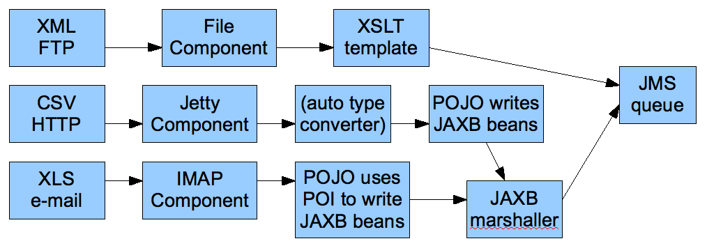

[[ConfluenceContent]]
[[Tutorial-Business-Partners-TutorialBusinessPartners]]
Tutorial Business Partners
~~~~~~~~~~~~~~~~~~~~~~~~~~

**Under Construction**

This tutorial is a work in progress.

[[Tutorial-Business-Partners-BackgroundandIntroduction]]
Background and Introduction
~~~~~~~~~~~~~~~~~~~~~~~~~~~

[[Tutorial-Business-Partners-BusinessBackground]]
Business Background
^^^^^^^^^^^^^^^^^^^

So there's a company, which we'll call Acme. Acme sells widgets, in a
fairly unusual way. Their customers are responsible for telling Acme
what they purchased. The customer enters into their own systems (ERP or
whatever) which widgets they bought from Acme. Then at some point, their
systems emit a record of the sale which needs to go to Acme so Acme can
bill them for it. Obviously, everyone wants this to be as automated as
possible, so there needs to be integration between the customer's system
and Acme.

Sadly, Acme's sales people are, technically speaking, doormats. They
tell all their prospects, "you can send us the data in whatever format,
using whatever protocols, whatever. You just can't change once it's up
and running."

The result is pretty much what you'd expect. Taking a random sample of 3
customers:

* Customer 1: *XML over FTP*
* Customer 2: *CSV over HTTP*
* Customer 3: *Excel via e-mail*

Now on the Acme side, all this has to be converted to a canonical XML
format and submitted to the Acme accounting system via JMS. Then the
Acme accounting system does its stuff and sends an XML reply via JMS,
with a summary of what it processed (e.g. 3 line items accepted, line
item #2 in error, total invoice $123.45). Finally, that data needs to be
formatted into an e-mail, and sent to a contact at the customer in
question ("Dear Joyce, we received an invoice on 1/2/08. We accepted 3
line items totaling $123.45, though there was an error with line items
#2 [invalid quantity ordered]. Thank you for your business. Love,
Acme.").

So it turns out Camel can handle all this:

* Listen for HTTP, e-mail, and FTP files
* Grab attachments from the e-mail messages
* Convert XML, XLS, and CSV files to a canonical XML format
* read and write JMS messages
* route based on company ID
* format e-mails using Velocity templates
* send outgoing e-mail messages

[[Tutorial-Business-Partners-TutorialBackground]]
Tutorial Background
^^^^^^^^^^^^^^^^^^^

This tutorial will cover all that, plus setting up tests along the way.

Before starting, you should be familiar with:

* Camel concepts including the link:camelcontext.html[CamelContext],
link:routes.html[Routes], link:components.html[Components and
Endpoints], and link:enterprise-integration-patterns.html[Enterprise
Integration Patterns]
* Configuring Camel with the link:spring.html[XML] or link:dsl.html[Java
DSL]

You'll learn:

* How to set up a Maven build for a Camel project
* How to transform XML, CSV, and Excel data into a standard XML format
with Camel
** How to write POJOs (Plain Old Java Objects), Velocity templates, and
XSLT stylesheets that are invoked by Camel routes for message
transformation
* How to configure simple and complex Routes in Camel, using either the
XML or the Java DSL format
* How to set up unit tests that load a Camel configuration and test
Camel routes
* How to use Camel's Data Formats to automatically convert data between
Java objects and XML, CSV files, etc.
* How to send and receive e-mail from Camel
* How to send and receive JMS messages from Camel
* How to use Enterprise Integration Patterns including Message Router
and Pipes and Filters
** How to use various languages to express content-based routing rules
in Camel
* How to deal with Camel messages, headers, and attachments

You may choose to treat this as a hands-on tutorial, and work through
building the code and configuration files yourself. Each of the sections
gives detailed descriptions of the steps that need to be taken to get
the components and routes working in Camel, and takes you through tests
to make sure they are working as expected.

But each section also links to working copies of the source and
configuration files, so if you don't want the hands-on approach, you can
simply review and/or download the finished files.

[[Tutorial-Business-Partners-High-LevelDiagram]]
High-Level Diagram
^^^^^^^^^^^^^^^^^^

Here's more or less what the integration process looks like.

First, the input from the customers to Acme:

And then, the output from Acme to the customers:

image:tutorial-business-partners.data/camel-trading-partners-output.png[image]

[[Tutorial-Business-Partners-TutorialTasks]]
Tutorial Tasks
^^^^^^^^^^^^^^

To get through this scenario, we're going to break it down into smaller
pieces, implement and test those, and then try to assemble the big
scenario and test that.

Here's what we'll try to accomplish:

1.  Create a Maven build for the project
2.  Get sample files for the customer Excel, CSV, and XML input
3.  Get a sample file for the canonical XML format that Acme's
accounting system uses
4.  Create an XSD for the canonical XML format
5.  Create JAXB POJOs corresponding to the canonical XSD
6.  Create an XSLT stylesheet to convert the Customer 1 (XML over FTP)
messages to the canonical format
7.  Create a unit test to ensure that a simple Camel route invoking the
XSLT stylesheet works
8.  Create a POJO that converts a `List<List<String>>` to the above JAXB
POJOs
* Note that Camel can automatically convert CSV input to a List of Lists
of Strings representing the rows and columns of the CSV, so we'll use
this POJO to handle Customer 2 (CSV over HTTP)
9.  Create a unit test to ensure that a simple Camel route invoking the
CSV processing works
10. Create a POJO that converts a Customer 3 Excel file to the above
JAXB POJOs (using POI to read Excel)
11. Create a unit test to ensure that a simple Camel route invoking the
Excel processing works
12. Create a POJO that reads an input message, takes an attachment off
the message, and replaces the body of the message with the attachment
* This is assuming for Customer 3 (Excel over e-mail) that the e-mail
contains a single Excel file as an attachment, and the actual e-mail
body is throwaway
13. Build a set of Camel routes to handle the entire input (Customer ->
Acme) side of the scenario.
14. Build unit tests for the Camel input.
15. *TODO:* Tasks for the output (Acme -> Customer) side of the scenario

[[Tutorial-Business-Partners-Let'sGetStarted!]]
Let's Get Started!
~~~~~~~~~~~~~~~~~~

[[Tutorial-Business-Partners-Step1:InitialMavenbuild]]
Step 1: Initial Maven build
^^^^^^^^^^^^^^^^^^^^^^^^^^^

We'll use Maven for this project as there will eventually be quite a few
dependencies and it's nice to have Maven handle them for us. You should
have a current version of Maven (e.g. 2.0.9) installed.

You can start with a pretty empty project directory and a Maven POM
file, or use a simple JAR archetype to create one.

Here's a sample POM. We've added a dependency on *camel-core*, and set
the compile version to 1.5 (so we can use annotations):

*pom.xml*

[source,brush:,java;,gutter:,false;,theme:,Default]
----
<?xml version="1.0" encoding="UTF-8"?>
<project xmlns="http://maven.apache.org/POM/4.0.0">
    <modelVersion>4.0.0</modelVersion>
    <groupId>org.apache.camel.tutorial</groupId>
    <artifactId>business-partners</artifactId>
    <version>1.0-SNAPSHOT</version>
    <name>Camel Business Partners Tutorial</name>
    <dependencies>
        <dependency>
            <artifactId>camel-core</artifactId>
            <groupId>org.apache.camel</groupId>
            <version>1.4.0</version>
        </dependency>
    </dependencies>
    <build>
        <plugins>
            <plugin>
                <groupId>org.apache.maven.plugins</groupId>
                <artifactId>maven-compiler-plugin</artifactId>
                <configuration>
                    <source>1.5</source>
                    <target>1.5</target>
                </configuration>
            </plugin>
        </plugins>
    </build>
</project>
----

[[Tutorial-Business-Partners-Step2:GetSampleFiles]]
Step 2: Get Sample Files
^^^^^^^^^^^^^^^^^^^^^^^^

You can make up your own if you like, but here are the "off the shelf"
ones. You can save yourself some time by downloading these to
`src/test/resources` in your Maven project.

* Customer 1 (XML):
link:tutorial-business-partners.data/input-customer1.xml?version=1&modificationDate=1221304897000&api=v2[input-customer1.xml]
* Customer 2 (CSV):
link:tutorial-business-partners.data/input-customer2.csv?version=1&modificationDate=1221304897000&api=v2[input-customer2.csv]
* Customer 3 (Excel):
link:tutorial-business-partners.data/input-customer3.xls?version=1&modificationDate=1221304897000&api=v2[input-customer3.xls]
* Canonical Acme XML Request:
link:tutorial-business-partners.data/canonical-acme-request.xml?version=1&modificationDate=1221304897000&api=v2[canonical-acme-request.xml]
* Canonical Acme XML Response: *TODO*

If you look at these files, you'll see that the different input formats
use different field names and/or ordering, because of course the sales
guys were totally OK with that. Sigh.

[[Tutorial-Business-Partners-Step3:XSDandJAXBBeansfortheCanonicalXMLFormat]]
Step 3: XSD and JAXB Beans for the Canonical XML Format
^^^^^^^^^^^^^^^^^^^^^^^^^^^^^^^^^^^^^^^^^^^^^^^^^^^^^^^

Here's the sample of the canonical XML file:

[source,brush:,java;,gutter:,false;,theme:,Default]
----
<?xml version="1.0" encoding="UTF-8"?>
<invoice xmlns="http://activemq.apache.org/camel/tutorial/partners/invoice">
  <partner-id>2</partner-id>
  <date-received>9/12/2008</date-received>
  <line-item>
    <product-id>134</product-id>
    <description>A widget</description>
    <quantity>3</quantity>
    <item-price>10.45</item-price>
    <order-date>6/5/2008</order-date>
  </line-item>
  <!-- // more line-item elements here -->
  <order-total>218.82</order-total>
</invoice>
----

If you're ambitions, you can write your own XSD (XML Schema) for files
that look like this, and save it to `src/main/xsd`.

*Solution:* If not, you can
link:tutorial-business-partners.data/canonical-acme-request.xsd?version=1&modificationDate=1221555594000&api=v2[download
mine], and save that to save it to `src/main/xsd`.

[[Tutorial-Business-Partners-GeneratingJAXBBeans]]
Generating JAXB Beans
+++++++++++++++++++++

Down the road we'll want to deal with the XML as Java POJOs. We'll take
a moment now to set up those XML binding POJOs. So we'll update the
Maven POM to generate JAXB beans from the XSD file.

We need a dependency:

[source,brush:,java;,gutter:,false;,theme:,Default]
----
<dependency>
    <artifactId>camel-jaxb</artifactId>
    <groupId>org.apache.camel</groupId>
    <version>1.4.0</version>
</dependency>
----

And a plugin configured:

[source,brush:,java;,gutter:,false;,theme:,Default]
----
<plugin>
    <groupId>org.codehaus.mojo</groupId>
    <artifactId>jaxb2-maven-plugin</artifactId>
    <executions>
        <execution>
            <goals>
                <goal>xjc</goal>
            </goals>
        </execution>
    </executions>
</plugin>
----

That should do it (it automatically looks for XML Schemas in
`src/main/xsd` to generate beans for). Run *mvn install* and it should
emit the beans into `target/generated-sources/jaxb`. Your IDE should see
them there, though you may need to update the project to reflect the new
settings in the Maven POM.

[[Tutorial-Business-Partners-Step4:InitialWorkonCustomer1Input(XMLoverFTP)]]
Step 4: Initial Work on Customer 1 Input (XML over FTP)
^^^^^^^^^^^^^^^^^^^^^^^^^^^^^^^^^^^^^^^^^^^^^^^^^^^^^^^

To get a start on Customer 1, we'll create an XSLT template to convert
the Customer 1 sample file into the canonical XML format, write a small
Camel route to test it, and build that into a unit test. If we get
through this, we can be pretty sure that the XSLT template is valid and
can be run safely in Camel.

[[Tutorial-Business-Partners-CreateanXSLTtemplate]]
Create an XSLT template
+++++++++++++++++++++++

Start with the
link:tutorial-business-partners.data/input-customer1.xml?version=1&modificationDate=1221304897000&api=v2[Customer
1 sample input]. You want to create an XSLT template to generate XML
like the canonical XML sample above – an `invoice` element with
`line-item` elements (one per item in the original XML document). If
you're especially clever, you can populate the current date and order
total elements too.

*Solution:* My
link:tutorial-business-partners.data/XMLConverter.xsl?version=1&modificationDate=1221315500000&api=v2[sample
XSLT template] isn't that smart, but it'll get you going if you don't
want to write one of your own.

[[Tutorial-Business-Partners-Createaunittest]]
Create a unit test
++++++++++++++++++

Here's where we get to some meaty Camel work. We need to:

* Set up a unit test
* That loads a Camel configuration
* That has a route invoking our XSLT
* Where the test sends a message to the route
* And ensures that some XML comes out the end of the route

The easiest way to do this is to set up a Spring context that defines
the Camel stuff, and then use a base unit test class from Spring that
knows how to load a Spring context to run tests against. So, the
procedure is:

[[Tutorial-Business-Partners-SetUpaSkeletalCamel/SpringUnitTest]]
Set Up a Skeletal Camel/Spring Unit Test

1.  Add dependencies on Camel-Spring, and the Spring test JAR (which
will automatically bring in JUnit 3.8.x) to your POM:
+
[source,brush:,java;,gutter:,false;,theme:,Default]
----
<dependency>
    <artifactId>camel-spring</artifactId>
    <groupId>org.apache.camel</groupId>
    <version>1.4.0</version>
</dependency>
<dependency>
    <artifactId>spring-test</artifactId>
    <groupId>org.springframework</groupId>
    <version>2.5.5</version>
    <scope>test</scope>
</dependency>
----
2.  Create a new unit test class in `src/test/java/your-package-here`,
perhaps called `XMLInputTest.java`
3.  Make the test extend Spring's
http://static.springframework.org/spring/docs/2.5.x/api/org/springframework/test/context/junit38/AbstractJUnit38SpringContextTests.html[AbstractJUnit38SpringContextTests]
class, so it can load a Spring context for the test
4.  Create a Spring context configuration file in `src/test/resources`,
perhaps called `XMLInputTest-context.xml`
5.  In the unit test class, use the class-level
http://static.springframework.org/spring/docs/2.5.x/api/org/springframework/test/context/ContextConfiguration.html[@ContextConfiguration]
annotation to indicate that a Spring context should be loaded
* By default, this looks for a Context configuration file called
`TestClassName-context.xml` in a subdirectory corresponding to the
package of the test class. For instance, if your test class was
`org.apache.camel.tutorial.XMLInputTest`, it would look for
`org/apache/camel/tutorial/XMLInputTest-context.xml`
* To override this default, use the *locations* attribute on the
@ContextConfiguration annotation to provide specific context file
locations (starting each path with a / if you don't want it to be
relative to the package directory). My solution does this so I can put
the context file directly in `src/test/resources` instead of in a
package directory under there.
6.  Add a
http://camel.apache.org/maven/current/camel-core/apidocs/org/apache/camel/CamelContext.html[CamelContext]
instance variable to the test class, with the
http://static.springframework.org/spring/docs/2.5.x/api/org/springframework/beans/factory/annotation/Autowired.html[@Autowired]
annotation. That way Spring will automatically pull the CamelContext out
of the Spring context and inject it into our test class.
7.  Add a
http://camel.apache.org/maven/current/camel-core/apidocs/org/apache/camel/ProducerTemplate.html[ProducerTemplate]
instance variable and a `setUp` method that instantiates it from the
CamelContext. We'll use the ProducerTemplate later to send messages to
the route.
+
[source,brush:,java;,gutter:,false;,theme:,Default]
----
protected ProducerTemplate<Exchange> template;

protected void setUp() throws Exception {
    super.setUp();
    template = camelContext.createProducerTemplate();
}
----
8.  Put in an empty test method just for the moment (so when we run this
we can see that "1 test succeeded")
9.  Add the Spring
http://static.springframework.org/spring/docs/2.5.x/reference/beans.html#beans-factory-metadata[<beans>]
element (including the
http://activemq.apache.org/camel/xml-reference.html[Camel Namespace])
with an empty link:spring.html[<camelContext>] element to the Spring
context, like this:
+
[source,brush:,java;,gutter:,false;,theme:,Default]
----
<?xml version="1.0" encoding="UTF-8"?>
<beans xmlns="http://www.springframework.org/schema/beans"
       xmlns:xsi="http://www.w3.org/2001/XMLSchema-instance"
       xsi:schemaLocation="http://www.springframework.org/schema/beans
                               http://www.springframework.org/schema/beans/spring-beans-2.5.xsd
                           http://activemq.apache.org/camel/schema/spring
                               http://activemq.apache.org/camel/schema/spring/camel-spring-1.4.0.xsd">

    <camelContext id="camel" xmlns="http://activemq.apache.org/camel/schema/spring">
    </camelContext>
</beans>
----

Test it by running *mvn install* and make sure there are no build
errors. So far it doesn't test much; just that your project and test and
source files are all organized correctly, and the one empty test method
completes successfully.

*Solution:* Your test class might look something like this:

* src/test/java/org/apache/camel/tutorial/link:tutorial-business-partners.data/empty-XMLInputTest.java?version=3&modificationDate=1221634419000&api=v2[XMLInputTest.java]
* src/test/resources/XMLInputTest-context.xml (same as just above)

[[Tutorial-Business-Partners-FleshOuttheUnitTest]]
Flesh Out the Unit Test

So now we're going to write a Camel route that applies the XSLT to the
sample Customer 1 input file, and makes sure that some XML output comes
out:

1.  Save the
link:tutorial-business-partners.data/input-customer1.xml?version=1&modificationDate=1221304897000&api=v2[input-customer1.xml]
file to `src/test/resources`
2.  Save your XSLT file (created in the previous step) to
`src/main/resources`
3.  Write a Camel Route, either right in the Spring XML, or using the
Java DSL (in another class under `src/test/java` somewhere). This route
should use the link:pipes-and-filters.html[Pipes and Filters]
integration pattern to:
1.  Start from the endpoint link:direct.html[direct:start] (which lets
the test conveniently pass messages into the route)
2.  Call the endpoint link:xslt.html[xslt:YourXSLTFile.xsl] (to
transform the message with the specified XSLT template)
3.  Send the result to the endpoint link:mock.html[mock:finish] (which
lets the test verify the route output)
4.  Add a test method to the unit test class that:
1.  Get a reference to the Mock endpoint `mock:finish` using code like
this:
+
[source,brush:,java;,gutter:,false;,theme:,Default]
----
MockEndpoint finish = MockEndpoint.resolve(camelContext, "mock:finish");
----
2.  Set the
http://camel.apache.org/maven/current/camel-core/apidocs/org/apache/camel/component/mock/MockEndpoint.html#setExpectedMessageCount(int)[expectedMessageCount]
on that endpoint to 1
3.  Get a reference to the Customer 1 input file, using code like this:
+
[source,brush:,java;,gutter:,false;,theme:,Default]
----
InputStream in = XMLInputTest.class.getResourceAsStream("/input-partner1.xml");
assertNotNull(in);
----
4.  Send that InputStream as a message to the `direct:start` endpoint,
using code like this:
+
[source,brush:,java;,gutter:,false;,theme:,Default]
----
    template.sendBody("direct:start", in);
----
+
Note that we can send the sample file body in several formats (File,
InputStream, String, etc.) but in this case an InputStream is pretty
convenient.
5.  Ensure that the message made it through the route to the final
endpoint, by testing all configured Mock endpoints
http://camel.apache.org/maven/current/camel-core/apidocs/org/apache/camel/component/mock/MockEndpoint.html#assertIsSatisfied(org.apache.camel.CamelContext)[like
this]:
+
[source,brush:,java;,gutter:,false;,theme:,Default]
----
MockEndpoint.assertIsSatisfied(camelContext);
----
6.  If you like, inspect the final message body using some code like
`finish.getExchanges().get(0).getIn().getBody()`.
* If you do this, you'll need to know what format that body is – String,
byte array, InputStream, etc.
5.  Run your test with *mvn install* and make sure the build completes
successfully.

*Solution:* Your finished test might look something like this:

* src/test/java/org/apache/camel/tutorial/link:tutorial-business-partners.data/XMLInputTest.java?version=3&modificationDate=1221637330000&api=v2[XMLInputTest.java]
* For XML Configuration:
** src/test/resources/link:tutorial-business-partners.data/XMLInputTest-context.xml?version=1&modificationDate=1221560232000&api=v2[XMLInputTest-context.xml]
* Or, for Java DSL Configuration:
** src/test/resources/link:tutorial-business-partners.data/XMLInputTest-dsl-context.xml?version=1&modificationDate=1221627131000&api=v2[XMLInputTest-dsl-context.xml]
** src/test/java/org/apache/camel/tutorial/routes/link:tutorial-business-partners.data/XMLInputTestRoute.java?version=1&modificationDate=1221627131000&api=v2[XMLInputTestRoute.java]

**Test Base Class**

Once your test class is working, you might want to extract things like
the @Autowired CamelContext, the ProducerTemplate, and the setUp method
to a custom base class that you extend with your other tests.

[[Tutorial-Business-Partners-Step5:InitialWorkonCustomer2Input(CSVoverHTTP)]]
Step 5: Initial Work on Customer 2 Input (CSV over HTTP)
^^^^^^^^^^^^^^^^^^^^^^^^^^^^^^^^^^^^^^^^^^^^^^^^^^^^^^^^

To get a start on Customer 2, we'll create a POJO to convert the
Customer 2 sample CSV data into the JAXB POJOs representing the
canonical XML format, write a small Camel route to test it, and build
that into a unit test. If we get through this, we can be pretty sure
that the CSV conversion and JAXB handling is valid and can be run safely
in Camel.

[[Tutorial-Business-Partners-CreateaCSV-handlingPOJO]]
Create a CSV-handling POJO
++++++++++++++++++++++++++

To begin with, link:csv.html[CSV is a known data format] in Camel. Camel
can convert a CSV file to a List (representing rows in the CSV) of Lists
(representing cells in the row) of Strings (the data for each cell).
That means our POJO can just assume the data coming in is of type
`List<List<String>>`, and we can declare a method with that as the
argument.

Looking at the JAXB code in `target/generated-sources/jaxb`, it looks
like an `Invoice` object represents the whole document, with a nested
list of LineItemType objects for the line items. Therefore our POJO
method will return an `Invoice` (a document in the canonical XML
format).

So to implement the CSV-to-JAXB POJO, we need to do something like this:

1.  Create a new class under `src/main/java`, perhaps called
`CSVConverterBean`.
2.  Add a method, with one argument of type `List<List<String>>` and the
return type `Invoice`
* You may link:bean.html[annotate] the argument with
http://camel.apache.org/maven/current/camel-core/apidocs/org/apache/camel/Body.html[@Body]
to specifically designate it as the body of the incoming message
3.  In the method, the logic should look roughly like this:
1.  Create a new `Invoice`, using the method on the generated
`ObjectFactory` class
2.  Loop through all the rows in the incoming CSV (the outer `List`)
3.  Skip the first row, which contains headers (column names)
4.  For the other rows:
1.  Create a new `LineItemType` (using the `ObjectFactory` again)
2.  Pick out all the cell values (the Strings in the inner `List`) and
put them into the correct fields of the `LineItemType`
* Not all of the values will actually go into the line item in this
example
* You may hardcode the column ordering based on the sample data file, or
else try to read it dynamically from the headers in the first line
* Note that you'll need to use a JAXB `DatatypeFactory` to create the
`XMLGregorianCalendar` values that JAXB uses for the `date` fields in
the XML – which probably means using a `SimpleDateFormat` to parse the
date and setting that date on a `GregorianCalendar`
3.  Add the line item to the invoice
5.  Populate the partner ID, date of receipt, and order total on the
`Invoice`
6.  Throw any exceptions out of the method, so Camel knows something
went wrong
7.  Return the finished `Invoice`

*Solution:* Here's an example of what the
link:tutorial-business-partners.data/CSVConverterBean.java?version=1&modificationDate=1221634021000&api=v2[CSVConverterBean]
might look like.

[[Tutorial-Business-Partners-Createaunittest.1]]
Create a unit test
++++++++++++++++++

Start with a simple test class and test Spring context like last time,
perhaps based on the name `CSVInputTest`:

*CSVInputTest.java*

[source,brush:,java;,gutter:,false;,theme:,Default]
----
/**
 * A test class the ensure we can convert Partner 2 CSV input files to the
 * canonical XML output format, using JAXB POJOs.
 */
@ContextConfiguration(locations = "/CSVInputTest-context.xml")
public class CSVInputTest extends AbstractJUnit38SpringContextTests {
    @Autowired
    protected CamelContext camelContext;
    protected ProducerTemplate<Exchange> template;

    protected void setUp() throws Exception {
        super.setUp();
        template = camelContext.createProducerTemplate();
    }

    public void testCSVConversion() {
        // TODO
    }
}
----

*CSVInputTest-context.xml*

[source,brush:,java;,gutter:,false;,theme:,Default]
----
<?xml version="1.0" encoding="UTF-8"?>
<beans xmlns="http://www.springframework.org/schema/beans"
       xmlns:xsi="http://www.w3.org/2001/XMLSchema-instance"
       xsi:schemaLocation="http://www.springframework.org/schema/beans
                               http://www.springframework.org/schema/beans/spring-beans-2.5.xsd
                           http://activemq.apache.org/camel/schema/spring
                               http://activemq.apache.org/camel/schema/spring/camel-spring-1.4.0.xsd">

    <camelContext id="camel" xmlns="http://activemq.apache.org/camel/schema/spring">
        <!-- TODO -->
    </camelContext>
</beans>
----

Now the meaty part is to flesh out the test class and write the Camel
routes.

1.  Update the Maven POM to include link:csv.html[CSV]
link:data-format.html[Data Format] support:
+
[source,brush:,java;,gutter:,false;,theme:,Default]
----
<dependency>
    <artifactId>camel-csv</artifactId>
    <groupId>org.apache.camel</groupId>
    <version>1.4.0</version>
</dependency>
----
2.  Write the routes (right in the Spring XML context, or using the Java
DSL) for the CSV conversion process, again using the
link:pipes-and-filters.html[Pipes and Filters] pattern:
1.  Start from the endpoint link:direct.html[direct:CSVstart] (which
lets the test conveniently pass messages into the route). We'll name
this differently than the starting point for the previous test, in case
you use the Java DSL and put all your routes in the same package (which
would mean that each test would load the DSL routes for several tests.)
2.  This time, there's a little preparation to be done. Camel doesn't
know that the initial input is a CSV, so it won't be able to convert it
to the expected `List<List<String>>` without a little hint. For that, we
need an link:data-format.html[unmarshal] transformation in the route.
The `unmarshal` method (in the DSL) or element (in the XML) takes a
child indicating the format to unmarshal; in this case that should be
`csv`.
3.  Next invoke the POJO to transform the message with a
link:bean.html[bean:CSVConverter] endpoint
4.  As before, send the result to the endpoint
link:mock.html[mock:finish] (which lets the test verify the route
output)
5.  Finally, we need a Spring `<bean>` element in the Spring context XML
file (but outside the `<camelContext>` element) to define the Spring
bean that our route invokes. This Spring bean should have a `name`
attribute that matches the name used in the `bean` endpoint
(`CSVConverter` in the example above), and a `class` attribute that
points to the CSV-to-JAXB POJO class you wrote above (such as,
`org.apache.camel.tutorial.CSVConverterBean`). When Spring is in the
picture, any `bean` endpoints look up Spring beans with the specified
name.
3.  Write a test method in the test class, which should look very
similar to the previous test class:
1.  Get the MockEndpoint for the final endpoint, and tell it to expect
one message
2.  Load the Partner 2 sample CSV file from the ClassPath, and send it
as the body of a message to the starting endpoint
3.  Verify that the final MockEndpoint is satisfied (that is, it
received one message) and examine the message body if you like
* Note that we didn't link:data-format.html[marshal] the JAXB POJOs to
XML in this test, so the final message should contain an `Invoice` as
the body. You could write a simple line of code to get the Exchange (and
Message) from the MockEndpoint to confirm that.
4.  Run this new test with *mvn install* and make sure it passes and the
build completes successfully.

*Solution:* Your finished test might look something like this:

* src/test/java/org/apache/camel/tutorial/link:tutorial-business-partners.data/CSVInputTest.java?version=2&modificationDate=1221678956000&api=v2[CSVInputTest.java]
* For XML Configuration:
** src/test/resources/link:tutorial-business-partners.data/CSVInputTest-context.xml?version=2&modificationDate=1221678956000&api=v2[CSVInputTest-context.xml]
* Or, for Java DSL Configuration:
** src/test/resources/link:tutorial-business-partners.data/CSVInputTest-dsl-context.xml?version=1&modificationDate=1221678956000&api=v2[CSVInputTest-dsl-context.xml]
** src/test/java/org/apache/camel/tutorial/routes/link:tutorial-business-partners.data/CSVInputTestRoute.java?version=2&modificationDate=1221679042000&api=v2[CSVInputTestRoute.java]

[[Tutorial-Business-Partners-Step6:InitialWorkonCustomer3Input(Excelovere-mail)]]
Step 6: Initial Work on Customer 3 Input (Excel over e-mail)
^^^^^^^^^^^^^^^^^^^^^^^^^^^^^^^^^^^^^^^^^^^^^^^^^^^^^^^^^^^^

To get a start on Customer 3, we'll create a POJO to convert the
Customer 3 sample Excel data into the JAXB POJOs representing the
canonical XML format, write a small Camel route to test it, and build
that into a unit test. If we get through this, we can be pretty sure
that the Excel conversion and JAXB handling is valid and can be run
safely in Camel.

[[Tutorial-Business-Partners-CreateanExcel-handlingPOJO]]
Create an Excel-handling POJO
+++++++++++++++++++++++++++++

Camel does not have a data format handler for Excel by default. We have
two options – create an Excel
http://camel.apache.org/maven/current/camel-core/apidocs/index.html[DataFormat]
(so Camel can convert Excel spreadsheets to something like the CSV
`List<List<String>>` automatically), or create a POJO that can translate
Excel data manually. For now, the second approach is easier (if we go
the `DataFormat` route, we need code to both read and write Excel files,
whereas otherwise read-only will do).

So, we need a POJO with a method that takes something like an
`InputStream` or `byte[]` as an argument, and returns in `Invoice` as
before. The process should look something like this:

1.  Update the Maven POM to include http://poi.apache.org/[POI] support:
+
[source,brush:,java;,gutter:,false;,theme:,Default]
----
<dependency>
    <artifactId>poi</artifactId>
    <groupId>org.apache.poi</groupId>
    <version>3.1-FINAL</version>
</dependency>
----
2.  Create a new class under `src/main/java`, perhaps called
`ExcelConverterBean`.
3.  Add a method, with one argument of type `InputStream` and the return
type `Invoice`
* You may link:bean.html[annotate] the argument with
http://camel.apache.org/maven/current/camel-core/apidocs/org/apache/camel/Body.html[@Body]
to specifically designate it as the body of the incoming message
4.  In the method, the logic should look roughly like this:
1.  Create a new `Invoice`, using the method on the generated
`ObjectFactory` class
2.  Create a new
http://poi.apache.org/apidocs/org/apache/poi/hssf/usermodel/HSSFWorkbook.html[HSSFWorkbook]
from the `InputStream`, and get the
http://poi.apache.org/apidocs/org/apache/poi/hssf/usermodel/HSSFWorkbook.html#getSheetAt(int)[first
sheet] from it
3.  Loop through
http://poi.apache.org/apidocs/org/apache/poi/hssf/usermodel/HSSFSheet.html#rowIterator()[all
the rows] in the sheet
4.  Skip the first row, which contains headers (column names)
5.  For the other rows:
1.  Create a new `LineItemType` (using the `ObjectFactory` again)
2.  Pick out
http://poi.apache.org/apidocs/org/apache/poi/hssf/usermodel/HSSFRow.html#cellIterator()[all
the cell values] and put them into the correct fields of the
`LineItemType` (you'll need some data type conversion logic)
* Not all of the values will actually go into the line item in this
example
* You may hardcode the column ordering based on the sample data file, or
else try to read it dynamically from the headers in the first line
* Note that you'll need to use a JAXB `DatatypeFactory` to create the
`XMLGregorianCalendar` values that JAXB uses for the `date` fields in
the XML – which probably means setting the
http://poi.apache.org/apidocs/org/apache/poi/hssf/usermodel/HSSFCell.html#getDateCellValue()[date
from a date cell] on a `GregorianCalendar`
3.  Add the line item to the invoice
6.  Populate the partner ID, date of receipt, and order total on the
`Invoice`
7.  Throw any exceptions out of the method, so Camel knows something
went wrong
8.  Return the finished `Invoice`

*Solution:* Here's an example of what the
link:tutorial-business-partners.data/ExcelConverterBean.java?version=1&modificationDate=1221702252000&api=v2[ExcelConverterBean]
might look like.

[[Tutorial-Business-Partners-Createaunittest.2]]
Create a unit test
++++++++++++++++++

The unit tests should be pretty familiar now. The test class and context
for the Excel bean should be quite similar to the CSV bean.

1.  Create the basic test class and corresponding Spring Context XML
configuration file
2.  The XML config should look a lot like the CSV test, except:
* Remember to use a different start endpoint name if you're using the
Java DSL and not use separate packages per test
* You don't need the `unmarshal` step since the Excel POJO takes the raw
`InputStream` from the source endpoint
* You'll declare a `<bean>` and endpoint for the Excel bean prepared
above instead of the CSV bean
3.  The test class should look a lot like the CSV test, except use the
right input file name and start endpoint name.

**Logging**

You may notice that your tests emit a lot less output all of a sudden.
The dependency on POI brought in Log4J and configured commons-logging to
use it, so now we need a
link:tutorial-business-partners.data/log4j.properties?version=1&modificationDate=1221732568000&api=v2[log4j.properties]
file to configure log output. You can use the attached one (snarfed from
ActiveMQ) or write your own; either way save it to `src/main/resources`
to ensure you continue to see log output.

*Solution:* Your finished test might look something like this:

* src/test/java/org/apache/camel/tutorial/link:tutorial-business-partners.data/ExcelInputTest.java?version=1&modificationDate=1221732213000&api=v2[ExcelInputTest.java]
* For XML Configuration:
** src/test/resources/link:tutorial-business-partners.data/ExcelInputTest-context.xml?version=1&modificationDate=1221732213000&api=v2[ExcelInputTest-context.xml]
* Or, for Java DSL Configuration:
** src/test/resources/link:tutorial-business-partners.data/ExcelInputTest-dsl-context.xml?version=1&modificationDate=1221732432000&api=v2[ExcelInputTest-dsl-context.xml]
** src/test/java/org/apache/camel/tutorial/routes/link:tutorial-business-partners.data/ExcelInputTestRoute.java?version=1&modificationDate=1221732432000&api=v2[ExcelInputTestRoute.java]

[[Tutorial-Business-Partners-Step7:PutthisalltogetherintoCamelroutesfortheCustomerInput]]
Step 7: Put this all together into Camel routes for the Customer Input
^^^^^^^^^^^^^^^^^^^^^^^^^^^^^^^^^^^^^^^^^^^^^^^^^^^^^^^^^^^^^^^^^^^^^^

With all the data type conversions working, the next step is to write
the real routes that listen for HTTP, FTP, or e-mail input, and write
the final XML output to an ActiveMQ queue. Along the way these routes
will use the data conversions we've developed above.

So we'll create 3 routes to start with, as shown in the diagram back at
the beginning:

1.  Accept XML orders over FTP from Customer 1 (we'll assume the FTP
server dumps files in a local directory on the Camel machine)
2.  Accept CSV orders over HTTP from Customer 2
3.  Accept Excel orders via e-mail from Customer 3 (we'll assume the
messages are sent to an account we can access via IMAP)

...

[[Tutorial-Business-Partners-Step8:CreateaunittestfortheCustomerInputRoutes]]
Step 8: Create a unit test for the Customer Input Routes
^^^^^^^^^^^^^^^^^^^^^^^^^^^^^^^^^^^^^^^^^^^^^^^^^^^^^^^^
