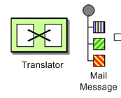
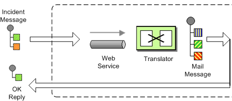
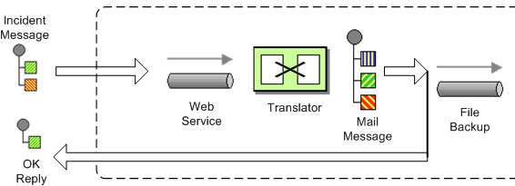
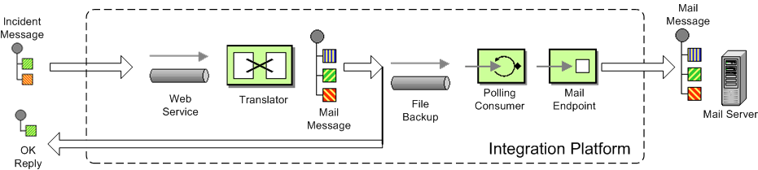

[[ConfluenceContent]]
[[Tutorial-Example-ReportIncident-Part4-Part4]]
Part 4
~~~~~~

[[Tutorial-Example-ReportIncident-Part4-Introduction]]
Introduction
~~~~~~~~~~~~

This section is about regular Camel. The examples presented here in this
section is much more in common of all the examples we have in the Camel
documentation.

If you have been reading the previous 3 parts then, this quote applies:

________________________________________
you must unlearn what you have learned +
_Master Yoda, Star Wars IV_
________________________________________

So we start all over again!
image:https://cwiki.apache.org/confluence/s/en_GB/5997/6f42626d00e36f53fe51440403446ca61552e2a2.1/_/images/icons/emoticons/wink.png[(wink)]

[[Tutorial-Example-ReportIncident-Part4-Routing]]
Routing
~~~~~~~

Camel is particular strong as a light-weight and agile *routing* and
*mediation* framework. In this part we will introduce the *routing*
concept and how we can introduce this into our solution. +
Looking back at the figure from the
link:tutorial-example-reportincident.html[Introduction] page we want to
implement this routing. Camel has support for expressing this
link:routes.html[routing logic using Java] as a DSL (Domain Specific
Language). In fact Camel also has DSL for XML and Scala. In this part we
use the Java DSL as its the most powerful and all developers know Java.
Later we will introduce the XML version that is very well integrated
with Spring.

Before we jump into it, we want to state that this tutorial is about
*Developers not loosing control*. In my humble experience one of the key
fears of developers is that they are forced into a tool/framework where
they loose control and/or power, and the possible is now impossible. So
in this part we stay clear with this vision and our starting point is as
follows:

* We have generated the webservice source code using the CXF wsdl2java
generator and we have our ReportIncidentEndpointImpl.java file where we
as a Developer feels home and have the power.

So the starting point is:

[source,brush:,java;,gutter:,false;,theme:,Default]
----
/**
 * The webservice we have implemented.
 */
public class ReportIncidentEndpointImpl implements ReportIncidentEndpoint {

    /**
     * This is the last solution displayed that is the most simple
     */
    public OutputReportIncident reportIncident(InputReportIncident parameters) {
        // WE ARE HERE !!!
        return null;
    }

}
----

Yes we have a simple plain Java class where we have the implementation
of the webservice. The cursor is blinking at the WE ARE HERE block and
this is where we feel home. More or less any Java Developers have
implemented webservices using a stack such as: Apache AXIS, Apache CXF
or some other quite popular framework. They all allow the developer to
be in control and implement the code logic as plain Java code. Camel of
course doesn't enforce this to be any different. Okay the boss told us
to implement the solution from the figure in the Introduction page and
we are now ready to code.

[[Tutorial-Example-ReportIncident-Part4-RouteBuilder]]
RouteBuilder
^^^^^^^^^^^^

*RouteBuilder* is the hearth in Camel of the Java DSL routing. This
class does all the heavy lifting of supporting EIP verbs for end-users
to express the routing. It does take a little while to get settled and
used to, but when you have worked with it for a while you will enjoy its
power and realize it is in fact a little language inside Java itself.
Camel is the *only* integration framework we are aware of that has Java
DSL, all the others are usually *only* XML based.

As an end-user you usually use the *RouteBuilder* as of follows:

* create your own Route class that extends *RouteBuilder*
* implement your routing DSL in the *configure* method

So we create a new class ReportIncidentRoutes and implement the first
part of the routing:

[source,brush:,java;,gutter:,false;,theme:,Default]
----
import org.apache.camel.builder.RouteBuilder;

public class ReportIncidentRoutes extends RouteBuilder {

    public void configure() throws Exception {
        // direct:start is a internal queue to kick-start the routing in our example
        // we use this as the starting point where you can send messages to direct:start
        from("direct:start")
            // to is the destination we send the message to our velocity endpoint
            // where we transform the mail body
            .to("velocity:MailBody.vm");
    }

}
----

What to notice here is the *configure* method. Here is where all the
action is. Here we have the Java DSL langauge, that is expressed using
the *fluent builder syntax* that is also known from Hibernate when you
build the dynamic queries etc. What you do is that you can stack methods
separating with the dot.

In the example above we have a very common routing, that can be
distilled from pseudo verbs to actual code with:

* from A to B
* From Endpoint A To Endpoint B
* from("endpointA").to("endpointB")
* from("direct:start").to("velocity:MailBody.vm");

*from("direct:start")* is the consumer that is kick-starting our routing
flow. It will wait for messages to arrive on the
link:direct.html[direct] queue and then dispatch the message. +
*to("velocity:MailBody.vm")* is the producer that will receive a message
and let Velocity generate the mail body response.

So what we have implemented so far with our ReportIncidentRoutes
RouteBuilder is this part of the picture: +

[[Tutorial-Example-ReportIncident-Part4-AddingtheRouteBuilder]]
Adding the RouteBuilder
^^^^^^^^^^^^^^^^^^^^^^^

Now we have our RouteBuilder we need to add/connect it to our
CamelContext that is the hearth of Camel. So turning back to our
webservice implementation class ReportIncidentEndpointImpl we add this
constructor to the code, to create the CamelContext and add the routes
from our route builder and finally to start it.

[source,brush:,java;,gutter:,false;,theme:,Default]
----
    private CamelContext context;

    public ReportIncidentEndpointImpl() throws Exception {
        // create the context
        context = new DefaultCamelContext();

        // append the routes to the context
        context.addRoutes(new ReportIncidentRoutes());

        // at the end start the camel context
        context.start();
    }
----

Okay how do you use the routes then? Well its just as before we use a
ProducerTemplate to send messages to Endpoints, so we just send to the
*direct:start* endpoint and it will take it from there. +
So we implement the logic in our webservice operation:

[source,brush:,java;,gutter:,false;,theme:,Default]
----
    /**
     * This is the last solution displayed that is the most simple
     */
    public OutputReportIncident reportIncident(InputReportIncident parameters) {
        Object mailBody = context.createProducerTemplate().sendBody("direct:start", parameters);
        System.out.println("Body:" + mailBody);

        // return an OK reply
        OutputReportIncident out = new OutputReportIncident();
        out.setCode("OK");
        return out;
    }
----

Notice that we get the producer template using the
*createProducerTemplate* method on the CamelContext. Then we send the
input parameters to the *direct:start* endpoint and it will route it
*to* the velocity endpoint that will generate the mail body. Since we
use *direct* as the consumer endpoint (=from) and its a *synchronous*
exchange we will get the response back from the route. And the response
is of course the output from the velocity endpoint.

**About creating ProducerTemplate**

In the example above we create a new `ProducerTemplate` when the
`reportIncident` method is invoked. However in reality you should only
create the template once and re-use it. See this
link:why-does-camel-use-too-many-threads-with-producertemplate.html[FAQ
entry].

We have now completed this part of the picture: +

[[Tutorial-Example-ReportIncident-Part4-Unittesting]]
Unit testing
~~~~~~~~~~~~

Now is the time we would like to unit test what we got now. So we call
for camel and its great test kit. For this to work we need to add it to
the pom.xml

[source,brush:,java;,gutter:,false;,theme:,Default]
----
        <dependency>
            <groupId>org.apache.camel</groupId>
            <artifactId>camel-core</artifactId>
            <version>1.4.0</version>
            <scope>test</scope>
            <type>test-jar</type>
        </dependency>
----

After adding it to the pom.xml you should refresh your Java Editor so it
pickups the new jar. Then we are ready to create out unit test class. +
We create this unit test skeleton, where we *extend* this class
`ContextTestSupport`

[source,brush:,java;,gutter:,false;,theme:,Default]
----
package org.apache.camel.example.reportincident;

import org.apache.camel.ContextTestSupport;
import org.apache.camel.builder.RouteBuilder;

/**
 * Unit test of our routes
 */
public class ReportIncidentRoutesTest extends ContextTestSupport {

}
----

`ContextTestSupport` is a supporting unit test class for much easier
unit testing with Apache Camel. The class is extending JUnit TestCase
itself so you get all its glory. What we need to do now is to somehow
tell this unit test class that it should use our route builder as this
is the one we gonna test. So we do this by implementing the
`createRouteBuilder` method.

[source,brush:,java;,gutter:,false;,theme:,Default]
----
    @Override
    protected RouteBuilder createRouteBuilder() throws Exception {
        return new ReportIncidentRoutes();
    }
----

That is easy just return an instance of our route builder and this unit
test will use our routes.

It is quite common in Camel itself to unit test using routes defined as
an anonymous inner class, such as illustrated below:

[source,brush:,java;,gutter:,false;,theme:,Default]
----
    protected RouteBuilder createRouteBuilder() throws Exception {
        return new RouteBuilder() {
            public void configure() throws Exception {
                // TODO: Add your routes here, such as:
                from("jms:queue:inbox").to("file://target/out");
            }
        };
    }
----

The same technique is of course also possible for end-users of Camel to
create parts of your routes and test them separately in many test
classes. +
However in this tutorial we test the real route that is to be used for
production, so we just return an instance of the real one.

We then code our unit test method that sends a message to the route and
assert that its transformed to the mail body using the Velocity
template.

[source,brush:,java;,gutter:,false;,theme:,Default]
----
    public void testTransformMailBody() throws Exception {
        // create a dummy input with some input data
        InputReportIncident parameters = createInput();

        // send the message (using the sendBody method that takes a parameters as the input body)
        // to "direct:start" that kick-starts the route
        // the response is returned as the out object, and its also the body of the response
        Object out = context.createProducerTemplate().sendBody("direct:start", parameters);

        // convert the response to a string using camel converters. However we could also have casted it to
        // a string directly but using the type converters ensure that Camel can convert it if it wasn't a string
        // in the first place. The type converters in Camel is really powerful and you will later learn to
        // appreciate them and wonder why its not build in Java out-of-the-box
        String body = context.getTypeConverter().convertTo(String.class, out);

        // do some simple assertions of the mail body
        assertTrue(body.startsWith("Incident 123 has been reported on the 2008-07-16 by Claus Ibsen."));
    }

    /**
     * Creates a dummy request to be used for input
     */
    protected InputReportIncident createInput() {
        InputReportIncident input = new InputReportIncident();
        input.setIncidentId("123");
        input.setIncidentDate("2008-07-16");
        input.setGivenName("Claus");
        input.setFamilyName("Ibsen");
        input.setSummary("bla bla");
        input.setDetails("more bla bla");
        input.setEmail("davsclaus@apache.org");
        input.setPhone("+45 2962 7576");
        return input;
    }
----

[[Tutorial-Example-ReportIncident-Part4-AddingtheFileBackup]]
Adding the File Backup
~~~~~~~~~~~~~~~~~~~~~~

The next piece of puzzle that is missing is to store the mail body as a
backup file. So we turn back to our route and the EIP patterns. We use
the link:pipes-and-filters.html[Pipes and Filters] pattern here to chain
the routing as:

[source,brush:,java;,gutter:,false;,theme:,Default]
----
    public void configure() throws Exception {
        from("direct:start")
            .to("velocity:MailBody.vm")
            // using pipes-and-filters we send the output from the previous to the next
            .to("file://target/subfolder");
     }
----

Notice that we just add a 2nd *.to* on the newline. Camel will default
use the link:pipes-and-filters.html[Pipes and Filters] pattern here when
there are multi endpoints chained liked this. We could have used the
*pipeline* verb to let out stand out that its the
link:pipes-and-filters.html[Pipes and Filters] pattern such as:

[source,brush:,java;,gutter:,false;,theme:,Default]
----
        from("direct:start")
            // using pipes-and-filters we send the output from the previous to the next
            .pipeline("velocity:MailBody.vm", "file://target/subfolder");
----

But most people are using the multi *.to* style instead.

We re-run out unit test and verifies that it still passes:

[source,brush:,java;,gutter:,false;,theme:,Default]
----
Running org.apache.camel.example.reportincident.ReportIncidentRoutesTest
Tests run: 1, Failures: 0, Errors: 0, Skipped: 0, Time elapsed: 1.157 sec
----

But hey we have added the file _producer_ endpoint and thus a file
should also be created as the backup file. If we look in the
`target/subfolder` we can see that something happened. +
On my humble laptop it created this folder:
*target\subfolder\ID-claus-acer*. So the file producer create a sub
folder named `ID-claus-acer` what is this? Well Camel auto generates an
unique filename based on the unique message id if not given instructions
to use a fixed filename. In fact it creates another sub folder and name
the file as: target\subfolder\ID-claus-acer\3750-1219148558921\1-0 where
1-0 is the file with the mail body. What we want is to use our own
filename instead of this auto generated filename. This is archived by
adding a header to the message with the filename to use. So we need to
add this to our route and compute the filename based on the message
content.

[[Tutorial-Example-ReportIncident-Part4-Settingthefilename]]
Setting the filename
^^^^^^^^^^^^^^^^^^^^

For starters we show the simple solution and build from there. We start
by setting a constant filename, just to verify that we are on the right
path, to instruct the file producer what filename to use. The file
producer uses a special header `FileComponent.HEADER_FILE_NAME` to set
the filename.

What we do is to send the header when we "kick-start" the routing as the
header will be propagated from the direct queue to the file producer.
What we need to do is to use the `ProducerTemplate.sendBodyAndHeader`
method that takes *both* a body and a header. So we change out
webservice code to include the filename also:

[source,brush:,java;,gutter:,false;,theme:,Default]
----
    public OutputReportIncident reportIncident(InputReportIncident parameters) {
        // create the producer template to use for sending messages
        ProducerTemplate producer = context.createProducerTemplate();
        // send the body and the filename defined with the special header key 
        Object mailBody = producer.sendBodyAndHeader("direct:start", parameters, FileComponent.HEADER_FILE_NAME, "incident.txt");
        System.out.println("Body:" + mailBody);

        // return an OK reply
        OutputReportIncident out = new OutputReportIncident();
        out.setCode("OK");
        return out;
    }
----

However we could also have used the route builder itself to configure
the constant filename as shown below:

[source,brush:,java;,gutter:,false;,theme:,Default]
----
    public void configure() throws Exception {
        from("direct:start")
            .to("velocity:MailBody.vm")
            // set the filename to a constant before the file producer receives the message
            .setHeader(FileComponent.HEADER_FILE_NAME, constant("incident.txt"))
            .to("file://target/subfolder");
     }
----

But Camel can be smarter and we want to dynamic set the filename based
on some of the input parameters, how can we do this? +
Well the obvious solution is to compute and set the filename from the
webservice implementation, but then the webservice implementation has
such logic and we want this decoupled, so we could create our own POJO
bean that has a method to compute the filename. We could then instruct
the routing to invoke this method to get the computed filename. This is
a string feature in Camel, its link:bean.html[Bean] binding. So lets
show how this can be done:

[[Tutorial-Example-ReportIncident-Part4-Usingtocomputethefilename]]
Using link:bean-language.html[Bean Language] to compute the filename
++++++++++++++++++++++++++++++++++++++++++++++++++++++++++++++++++++

First we create our plain java class that computes the filename, and it
has 100% no dependencies to Camel what so ever.

[source,brush:,java;,gutter:,false;,theme:,Default]
----
/**
 * Plain java class to be used for filename generation based on the reported incident
 */
public class FilenameGenerator {

    public String generateFilename(InputReportIncident input) {
        // compute the filename
        return "incident-" + input.getIncidentId() + ".txt";
    }

}
----

The class is very simple and we could easily create unit tests for it to
verify that it works as expected. So what we want now is to let Camel
invoke this class and its generateFilename with the input parameters and
use the output as the filename. Pheeeww is this really possible
out-of-the-box in Camel? Yes it is. So lets get on with the show. We
have the code that computes the filename, we just need to call it from
our route using the link:bean-language.html[Bean Language]:

[source,brush:,java;,gutter:,false;,theme:,Default]
----
    public void configure() throws Exception {
        from("direct:start")
            // set the filename using the bean language and call the FilenameGenerator class.
            // the 2nd null parameter is optional methodname, to be used to avoid ambiguity.
            // if not provided Camel will try to figure out the best method to invoke, as we
            // only have one method this is very simple
            .setHeader(FileComponent.HEADER_FILE_NAME, BeanLanguage.bean(FilenameGenerator.class, null))
            .to("velocity:MailBody.vm")
            .to("file://target/subfolder");
    }
----

Notice that we use the *bean* language where we supply the class with
our bean to invoke. Camel will instantiate an instance of the class and
invoke the suited method. For completeness and ease of code readability
we add the method name as the 2nd parameter

[source,brush:,java;,gutter:,false;,theme:,Default]
----
            .setHeader(FileComponent.HEADER_FILE_NAME, BeanLanguage.bean(FilenameGenerator.class, "generateFilename"))
----

Then other developers can understand what the parameter is, instead of
`null`.

Now we have a nice solution, but as a sidetrack I want to demonstrate
the Camel has other languages out-of-the-box, and that scripting
language is a first class citizen in Camel where it etc. can be used in
content based routing. However we want it to be used for the filename
generation.

[[Tutorial-Example-ReportIncident-Part4-Usingascriptlanguagetosetthefilename]]
Using a script language to set the filename
+++++++++++++++++++++++++++++++++++++++++++

We could do as in the previous parts where we send the computed filename
as a message header when we "kick-start" the route. But we want to learn
new stuff so we look for a different solution using some of Camels many
link:languages.html[Languages]. As link:ognl.html[OGNL] is a favorite
language of mine (used by WebWork) so we pick this baby for a Camel
ride. For starters we must add it to our pom.xml:

[source,brush:,java;,gutter:,false;,theme:,Default]
----
        <dependency>
            <groupId>org.apache.camel</groupId>
            <artifactId>camel-ognl</artifactId>
            <version>${camel-version}</version>
        </dependency>
----

And remember to refresh your editor so you got the new .jars. +
We want to construct the filename based on this syntax:
`mail-incident-#ID#.txt` where #ID# is the incident id from the input
parameters. As link:ognl.html[OGNL] is a language that can invoke
methods on bean we can invoke the `getIncidentId()` on the message body
and then concat it with the fixed pre and postfix strings.

In link:ognl.html[OGNL] glory this is done as:

[source,brush:,java;,gutter:,false;,theme:,Default]
----
"'mail-incident-' + request.body.incidentId + '.txt'"
----

where `request.body.incidentId` computes to:

* *request* is the IN message. See the link:ognl.html[OGNL] for other
predefined objects available
* *body* is the body of the in message
* *incidentId* will invoke the `getIncidentId()` method on the body. +
The rest is just more or less regular plain code where we can concat
strings.

Now we got the expression to dynamic compute the filename on the fly we
need to set it on our route so we turn back to our route, where we can
add the OGNL expression:

[source,brush:,java;,gutter:,false;,theme:,Default]
----
    public void configure() throws Exception {
        from("direct:start")
            // we need to set the filename and uses OGNL for this
            .setHeader(FileComponent.HEADER_FILE_NAME, OgnlExpression.ognl("'mail-incident-' + request.body.incidentId + '.txt'"))
            // using pipes-and-filters we send the output from the previous to the next
            .pipeline("velocity:MailBody.vm", "file://target/subfolder");
    }
----

And since we are on Java 1.5 we can use the static import of *ognl* so
we have:

[source,brush:,java;,gutter:,false;,theme:,Default]
----
import static org.apache.camel.language.ognl.OgnlExpression.ognl;
...
    .setHeader(FileComponent.HEADER_FILE_NAME, ognl("'mail-incident-' + request.body.incidentId + '.txt'"))
----

Notice the import static also applies for all the other languages, such
as the link:bean-language.html[Bean Language] we used previously.

Whatever worked for you we have now implemented the backup of the data
files: +

[[Tutorial-Example-ReportIncident-Part4-Sendingtheemail]]
Sending the email
~~~~~~~~~~~~~~~~~

What we need to do before the solution is completed is to actually send
the email with the mail body we generated and stored as a file. In the
previous part we did this with a link:file2.html[File] consumer, that we
manually added to the CamelContext. We can do this quite easily with the
routing.

[source,brush:,java;,gutter:,false;,theme:,Default]
----
import org.apache.camel.builder.RouteBuilder;

public class ReportIncidentRoutes extends RouteBuilder {

    public void configure() throws Exception {
        // first part from the webservice -> file backup
        from("direct:start")
            .setHeader(FileComponent.HEADER_FILE_NAME, bean(FilenameGenerator.class, "generateFilename"))
            .to("velocity:MailBody.vm")
            .to("file://target/subfolder");

        // second part from the file backup -> send email
        from("file://target/subfolder")
            // set the subject of the email
            .setHeader("subject", constant("new incident reported"))
            // send the email
            .to("smtp://someone@localhost?password=secret&to=incident@mycompany.com");
    }

}
----

The last 3 lines of code does all this. It adds a file consumer
*from("file://target/subfolder")*, sets the mail subject, and finally
send it as an email.

The DSL is really powerful where you can express your routing
integration logic. +
So we completed the last piece in the picture puzzle with just 3 lines
of code.

We have now completed the integration: +

[[Tutorial-Example-ReportIncident-Part4-Conclusion]]
Conclusion
~~~~~~~~~~

We have just briefly touched the *routing* in Camel and shown how to
implement them using the *fluent builder* syntax in Java. There is much
more to the routing in Camel than shown here, but we are learning step
by step. We continue in part 5. See you there.

[[Tutorial-Example-ReportIncident-Part4-Links]]
Links
~~~~~

* link:tutorial-example-reportincident.html[Introduction]
* link:tutorial-example-reportincident-part1.html[Part 1]
* link:tutorial-example-reportincident-part2.html[Part 2]
* link:tutorial-example-reportincident-part3.html[Part 3]
* link:tutorial-example-reportincident-part4.html[Part 4]
* link:tutorial-example-reportincident-part5.html[Part 5]
* link:tutorial-example-reportincident-part6.html[Part 6]
