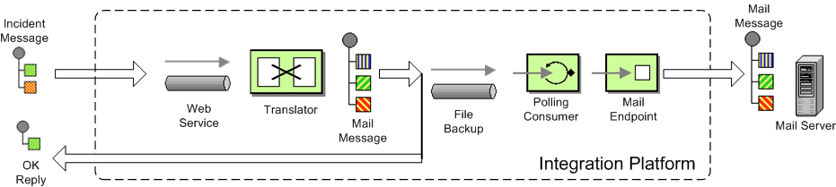

[[ConfluenceContent]]
[[Tutorial-Example-ReportIncident-Tutorial-camel-example-reportincident]]
Tutorial - camel-example-reportincident
~~~~~~~~~~~~~~~~~~~~~~~~~~~~~~~~~~~~~~~

[[Tutorial-Example-ReportIncident-Introduction]]
Introduction
~~~~~~~~~~~~

Creating this tutorial was inspired by a real life use-case I discussed
over the phone with a colleague. He was working at a client whom uses a
heavy-weight integration platform from a very large vendor. He was in
talks with developer shops to implement a new integration on this
platform. His trouble was the shop tripled the price when they realized
the platform of choice. So I was wondering how we could do this
integration with Camel. Can it be done, without tripling the cost
image:https://cwiki.apache.org/confluence/s/en_GB/5997/6f42626d00e36f53fe51440403446ca61552e2a2.1/_/images/icons/emoticons/wink.png[(wink)].

This tutorial is written during the development of the integration. I
have decided to start off with a sample that isn't Camel's but standard
Java and then plugin Camel as we goes. Just as when people needed to
learn Spring you could consume it piece by piece, the same goes with
Camel.

The target reader is person whom hasn't experience or just started using
Camel.

[[Tutorial-Example-ReportIncident-Motivationforthistutorial]]
Motivation for this tutorial
~~~~~~~~~~~~~~~~~~~~~~~~~~~~

I wrote this tutorial motivated as Camel lacked an example application
that was based on the web application deployment model. The entire world
hasn't moved to pure OSGi deployments yet.

The full source code for this tutorial as complete is part of the Apache
Camel distribution in the `examples/camel-example-reportincident`
directory

[[Tutorial-Example-ReportIncident-Theuse-case]]
The use-case
~~~~~~~~~~~~

The goal is to allow staff to report incidents into a central
administration. For that they use client software where they report the
incident and submit it to the central administration. As this is an
integration in a transition phase the administration should get these
incidents by email whereas they are manually added to the database. The
client software should gather the incident and submit the information to
the integration platform that in term will transform the report into an
email and send it to the central administrator for manual processing.

The figure below illustrates this process. The end users reports the
incidents using the client applications. The incident is sent to the
central integration platform as webservice. The integration platform
will process the incident and send an OK acknowledgment back to the
client. Then the integration will transform the message to an email and
send it to the administration mail server. The users in the
administration will receive the emails and take it from there.

[[Tutorial-Example-ReportIncident-InEIPpatterns]]
In EIP patterns
^^^^^^^^^^^^^^^

We distill the use case as
http://www.enterpriseintegrationpatterns.com[EIP] patterns: +

[[Tutorial-Example-ReportIncident-Parts]]
Parts
~~~~~

This tutorial is divided into sections and parts:

*Section A: Existing Solution, how to slowly use Camel*

Part 1 - This first part explain how to setup the project and get a
webservice exposed using http://cxf.apache.org/[Apache CXF]. In fact we
don't touch Camel yet.

Part 2 - Now we are ready to introduce Camel piece by piece (without
using Spring or any XML configuration file) and create the full feature
integration. This part will introduce different Camel's concepts and How
we can build our solution using them like :

* CamelContext
* Endpoint, Exchange & Producer
* Components : Log, File

Part 3 - Continued from part 2 where we implement that last part of the
solution with the event driven consumer and how to send the email
through the Mail component.

*Section B: The Camel Solution*

Part 4 - We now turn into the path of Camel where it excels - the
routing. +
Part 5 - Is about how embed Camel with Spring and using
link:cxf.html[CXF] endpoints directly in Camel +
Part 6 - Showing a alternative solution primarily using XML instead of
Java code

**Using Axis 2**

See this blog entry by Sagara demonstrating how to use
http://ws.apache.org/axis2/[Apache Axis 2] instead of
http://cxf.apache.org/[Apache CXF] as the web service framework.

[[Tutorial-Example-ReportIncident-Links]]
Links
~~~~~

* link:tutorial-example-reportincident.html[Introduction]
* link:tutorial-example-reportincident-part1.html[Part 1]
* link:tutorial-example-reportincident-part2.html[Part 2]
* link:tutorial-example-reportincident-part3.html[Part 3]
* link:tutorial-example-reportincident-part4.html[Part 4]
* link:tutorial-example-reportincident-part5.html[Part 5]
* link:tutorial-example-reportincident-part6.html[Part 6]
