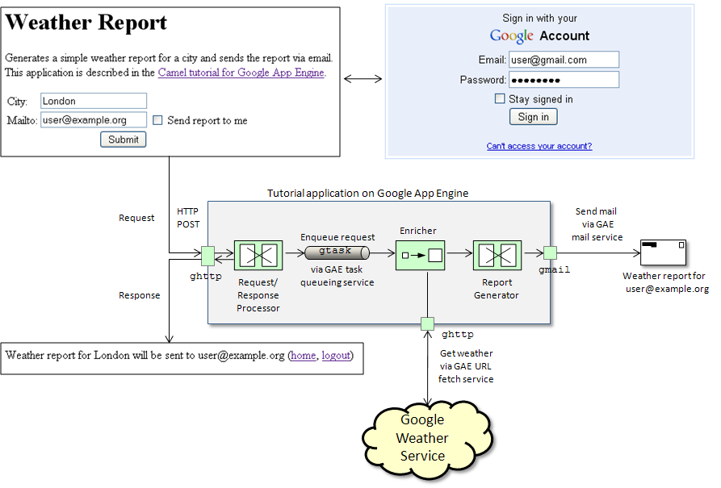
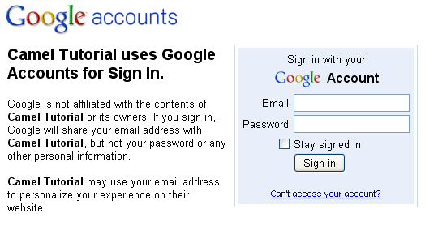
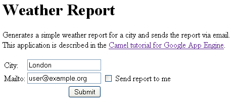
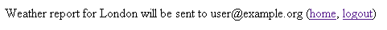

[[ConfluenceContent]]
[[TutorialforCamelonGoogleAppEngine-CamelonGoogleAppEngineTutorial]]
Camel on Google App Engine Tutorial
~~~~~~~~~~~~~~~~~~~~~~~~~~~~~~~~~~~

[[TutorialforCamelonGoogleAppEngine-Overview]]
Overview
^^^^^^^^

Goal of this tutorial is to get a non-trivial Camel application running
on Google App Engine (GAE). For developing that application the
link:gae.html[Camel Components for Google App Engine] are used. The
example web application generates a weather report for a city that is
entered by the user into a form and sends the weather report via email
to either the currently logged-in user or a user-defined receiver. The
following figure gives an overview. Users of this application need to
login with their Google account.

POSTed form data are dispatched to the Camel application via the
link:ghttp.html[ghttp] component. The application transforms the report
request and enqueues it with the link:gtask.html[gtask] component for
further background processing. It then generates an immediate HTML
response containing information about the city and the receiver of the
report. The response also contains a link logging out from the
application. In the background, the application retrieves weather data
from the Google Weather Service, transforms the data to generate a
simple weather report and sends the report by email via the
link:gmail.html[gmail] component.

**Java clients**

Clients other than web browsers may also interact with this application
by POSTing the form data and an authentication cookie. At the moment the
example application doesn't include a standalone Java client that
demonstrates how to do that. This is work in progress. In the meantime,
refer to the link:glogin.html[glogin] component documentation for
instructions how to access security-enabled GAE services.

**Tutorial online**

The next two sections describe how to checkout, build and deploy the
example application. If you want to skip these steps, go directly to the
link:tutorial-for-camel-on-google-app-engine.html[#Usage] section and
use the pre-deployed example application at
http://camelcloud.appspot.com.

[[TutorialforCamelonGoogleAppEngine-Prerequisites]]
Prerequisites
^^^^^^^^^^^^^

* https://appengine.google.com/[Sign up] for a Google App Engine account
if you don't have one.
* Create a new application via the https://appengine.google.com/[admin
console] or reuse an existing one for uploading the example.
* Install the http://code.google.com/appengine/downloads.html[Google App
Engine SDK for Java]. This tutorial has been tested with version 1.3.6.

[[TutorialforCamelonGoogleAppEngine-Deployment]]
Deployment
^^^^^^^^^^

First, checkout the sources from the Camel code repository.

....
svn co http://svn.apache.org/repos/asf/camel/trunk camel 
....

Navigate to the camel-example-gae and install from here.

Open the `camel-example-gae/src/main/webapp/WEB-INF/application-web.xml`
file and replace the template application name `replaceme` with the name
of the application that you created in the previous section. Optionally,
adjust the version number if needed.

*appengine-web.xml*

[source,brush:,java;,gutter:,false;,theme:,Default]
----
<?xml version="1.0" encoding="utf-8"?>
<appengine-web-app xmlns="http://appengine.google.com/ns/1.0">
    <!-- 
        Set your application name and version here
     -->
    <application>replaceme</application>
    <version>1</version>
    
    <static-files>
        <exclude path="/index.html" />
    </static-files>

    <system-properties>
        <property name="java.util.logging.config.file" value="WEB-INF/logging.properties"/>
    </system-properties>
    
</appengine-web-app>
----

Then go to the `camel-example-gae` directory and enter

....
mvn install
....

This will create the application `war` file in the target directory.
Finally use the `appcfg` command-line tool of the App Engine SDK to
deploy the application.

....
appcfg update target/camel-example-gae-<version>
....

where `version` needs to be replaced with the version of Camel you're
using. You will be prompted for the email address and password of your
Google App Engine account. After deployment the example application is
ready to use.

[[TutorialforCamelonGoogleAppEngine-Usage]]
Usage
^^^^^

In the following, the application name `camelcloud` will be used as an
example. If you deployed the example application somewhere else, use
your application name instead. Go to `http://camelcloud.appspot.com`.
The application will redirect you to a login page (see also
link:gsec.html[Security for Camel GAE Applications]).

After login, the application displays the tutorial's main page where you
can enter the name of a city and optionally enter an email address where
to send the waether report. If you check `Send report to me` the report
will be send to the email address that you used for login.

After pressing `Submit` the response is

The `home` link brings you back to the main page, the logout link is to
logout from the application (which brings you back to the login page).
In the background, the current weather conditions for the user-entered
city will be retrieved from the Google weather service and a formatted
weather report will be send by email. Submitting the form the first time
initializes the application on Google App Engine which can take several
seconds. Subsequent submissions (within a certain time frame) are served
much faster. Check your emails and you should now see a new email with
subject `Wheather report` and content similar to this one:

....
Weather report for:  London, England
Current condition:   Klar
Current temperature: 12 (Celsius) 
....

The report is partly internationalized, depending on the language
settings of your browser.

[[TutorialforCamelonGoogleAppEngine-Codewalkthrough]]
Code walkthrough
^^^^^^^^^^^^^^^^

The
http://svn.apache.org/viewvc/camel/trunk/examples/camel-example-gae/src/main/java/org/apache/camel/example/gae/TutorialRouteBuilder.java?view=markup[`TutorialRouteBuilder`]
implements the message processing routes shown in the
link:tutorial-for-camel-on-google-app-engine.html[#Overview] section.
Input form data are received via the link:ghttp.html[ghttp] component.
After receiving the request a
http://svn.apache.org/viewvc/camel/trunk/examples/camel-example-gae/src/main/java/org/apache/camel/example/gae/RequestProcessor.java?view=markup[`RequestProcessor`]
adds the form data and information about the current user to a
http://svn.apache.org/viewvc/camel/trunk/examples/camel-example-gae/src/main/java/org/apache/camel/example/gae/ReportData.java?view=markup[`ReportData`]
POJO. The `ReportData` object is then serialized and queued for
background processing. Queueing messages on GAE is done with the
link:gtask.html[gtask] component. After adding the `ReportData` object
to the queue an HTML response is generated with the
http://svn.apache.org/viewvc/camel/trunk/examples/camel-example-gae/src/main/java/org/apache/camel/example/gae/ResponseProcessor.java?view=markup[`ResponseProcessor`].

*TutorialRouteBuilder.java*

[source,brush:,java;,gutter:,false;,theme:,Default]
----
package org.apache.camel.example.gae;

import org.w3c.dom.Document;

import org.apache.camel.Exchange;
import org.apache.camel.builder.RouteBuilder;
import org.apache.camel.component.gae.mail.GMailBinding;
import org.apache.camel.processor.aggregate.AggregationStrategy;

public class TutorialRouteBuilder extends RouteBuilder {

    @Override
    public void configure() throws Exception {
        from("ghttp:///weather")
            .process(new RequestProcessor())
            .marshal().serialization()
            .to("gtask://default")
            .unmarshal().serialization()
            .process(new ResponseProcessor());
      
        from("gtask://default")
            .unmarshal().serialization()
            .setHeader(Exchange.HTTP_QUERY, constant("weather=").append(ReportData.city()))
            .enrich("ghttp://www.google.com/ig/api", reportDataAggregator())
            .setHeader(GMailBinding.GMAIL_SUBJECT, constant("Weather report"))
            .setHeader(GMailBinding.GMAIL_SENDER, ReportData.requestor())
            .setHeader(GMailBinding.GMAIL_TO, ReportData.recipient())
            .process(new ReportGenerator())        
            .to("gmail://default");
    }

    private static AggregationStrategy reportDataAggregator() {
        return new AggregationStrategy() {
            public Exchange aggregate(Exchange reportExchange, Exchange weatherExchange) {
                ReportData reportData = reportExchange.getIn().getBody(ReportData.class);
                reportData.setWeather(weatherExchange.getIn().getBody(Document.class));
                return reportExchange;
            }
        };
    }
    
}
----

Background processing of the queued messages starts
`from("gtask://default")`. The first step is to enrich the previously
generated `ReportData` object with data from the Google weather service.
The service URL is dynamically constructed by setting the
`Exchange.HTTP_QUERY` header to `weather=<city>`. For example, if the
user entered `London` in the city field of the form the resulting URL is
http://www.google.com/ig/api?weather=London[ghttp://www.google.com/ig/api?weather=London].
The weather service is accessed with the link:ghttp.html[ghttp]
component and the weather service response is aggregated into the
`ReportData` object using a custom aggregator returned by the
`reportDataAggregator()` method. Generating a simple weather report from
`ReportData` is done by the
http://svn.apache.org/viewvc/camel/trunk/examples/camel-example-gae/src/main/java/org/apache/camel/example/gae/ReportGenerator.java?view=markup[`ReportGenerator`].
The report is then sent by email with the link:gmail.html[gmail]
component.
