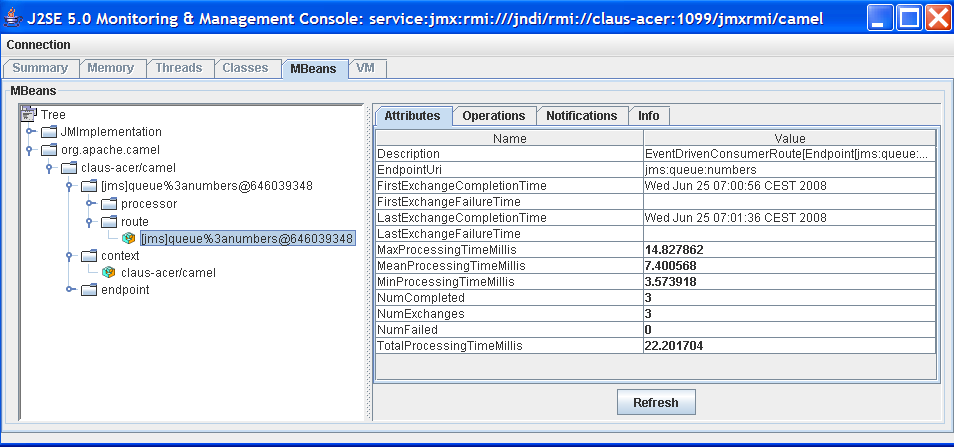

[[ConfluenceContent]]
[[Tutorial-JmsRemoting-TutorialonSpringRemotingwithJMS]]
Tutorial on Spring Remoting with JMS
~~~~~~~~~~~~~~~~~~~~~~~~~~~~~~~~~~~~

 

Thanks

This tutorial was kindly donated to Apache Camel by Martin Gilday.

[[Tutorial-JmsRemoting-Preface]]
Preface
~~~~~~~

This tutorial aims to guide the reader through the stages of creating a
project which uses Camel to facilitate the routing of messages from a
JMS queue to a http://www.springramework.org[Spring] service. The route
works in a synchronous fashion returning a response to the client.

[[Tutorial-JmsRemoting-Prerequisites]]
Prerequisites
~~~~~~~~~~~~~

This tutorial uses Maven to setup the Camel project and for dependencies
for artifacts.

[[Tutorial-JmsRemoting-Distribution]]
Distribution
~~~~~~~~~~~~

This sample is distributed with the Camel distribution as
`examples/camel-example-spring-jms`.

[[Tutorial-JmsRemoting-About]]
About
~~~~~

This tutorial is a simple example that demonstrates more the fact how
well Camel is seamless integrated with Spring to leverage the best of
both worlds. This sample is client server solution using JMS messaging
as the transport. The sample has two flavors of servers and also for
clients demonstrating different techniques for easy communication.

The Server is a JMS message broker that routes incoming messages to a
business service that does computations on the received message and
returns a response. +
The EIP patterns used in this sample are:

[width="100%",cols="50%,50%",options="header",]
|=======================================================================
|Pattern |Description
|link:message-channel.html[Message Channel] |We need a channel so the
Clients can communicate with the server.

|link:message.html[Message] |The information is exchanged using the
Camel Message interface.

|link:message-translator.html[Message Translator] |This is where Camel
shines as the message exchange between the Server and the Clients are
text based strings with numbers. However our business service uses int
for numbers. So Camel can do the message translation automatically.

|link:message-endpoint.html[Message Endpoint] |It should be easy to send
messages to the Server from the the clients. This is achieved with
Camel's powerful Endpoint pattern that even can be more powerful
combined with Spring remoting. The tutorial has clients using each kind
of technique for this.

|link:point-to-point-channel.html[Point to Point Channel] |The client
and server exchange data using point to point using a JMS queue.

|link:event-driven-consumer.html[Event Driven Consumer] |The JMS broker
is event driven and is invoked when the client sends a message to the
server.
|=======================================================================

We use the following Camel components:

[width="100%",cols="50%,50%",options="header",]
|=======================================================================
|Component |Description
|link:activemq.html[ActiveMQ] |We use Apache ActiveMQ as the JMS broker
on the Server side

|link:bean.html[Bean] |We use the bean binding to easily route the
messages to our business service. This is a very powerful component in
Camel.

|link:file2.html[File] |In the AOP enabled Server we store audit trails
as files.

|link:jms.html[JMS] |Used for the JMS messaging
|=======================================================================

[[Tutorial-JmsRemoting-CreatetheCamelProject]]
Create the Camel Project
~~~~~~~~~~~~~~~~~~~~~~~~

For the purposes of the tutorial a single Maven project will be used for
both the client and server. Ideally you would break your application
down into the appropriate components.

mvn archetype:generate -DgroupId=org.example
-DartifactId=CamelWithJmsAndSpring

[[Tutorial-JmsRemoting-UpdatethePOMwithDependencies]]
Update the POM with Dependencies
^^^^^^^^^^^^^^^^^^^^^^^^^^^^^^^^

First we need to have dependencies for the core Camel jars, spring, jms
components, and finally ActiveMQ as the message
broker.\{snippet:id=e1|lang=xml|url=camel/trunk/examples/camel-example-spring-jms/pom.xml}As
we use spring xml configuration for the ActiveMQ JMS broker we need this
dependency:\{snippet:id=e2|lang=xml|url=camel/trunk/examples/camel-example-spring-jms/pom.xml}

[[Tutorial-JmsRemoting-WritingtheServer]]
Writing the Server
~~~~~~~~~~~~~~~~~~

[[Tutorial-JmsRemoting-CreatetheSpringService]]
Create the Spring Service
^^^^^^^^^^^^^^^^^^^^^^^^^

For this example the Spring service (our business service) on the server
will be a simple multiplier which trebles in the received
value.\{snippet:id=e1|lang=java|url=camel/trunk/examples/camel-example-spring-jms/src/main/java/org/apache/camel/example/server/Multiplier.java}And
the implementation of this service
is:\{snippet:id=e1|lang=java|url=camel/trunk/examples/camel-example-spring-jms/src/main/java/org/apache/camel/example/server/Treble.java}Notice
that this class has been annotated with the @Service spring annotation.
This ensures that this class is registered as a bean in the registry
with the given name *multiplier*.

[[Tutorial-JmsRemoting-DefinetheCamelRoutes]]
Define the Camel Routes
^^^^^^^^^^^^^^^^^^^^^^^

\{snippet:id=e1|lang=java|url=camel/trunk/examples/camel-example-spring-jms/src/main/java/org/apache/camel/example/server/ServerRoutes.java}This
defines a Camel route _from_ the JMS queue named *numbers* _to_ the
Spring link:bean.html[bean] named *multiplier*. Camel will create a
consumer to the JMS queue which forwards all received messages onto the
the Spring bean, using the method named *multiply*.

[[Tutorial-JmsRemoting-ConfigureSpring]]
Configure Spring
^^^^^^^^^^^^^^^^

The Spring config file is placed under `META-INF/spring` as this is the
default location used by the link:camel-maven-plugin.html[Camel Maven
Plugin], which we will later use to run our server. +
First we need to do the standard scheme declarations in the top. In the
camel-server.xml we are using spring beans as the default *bean:*
namespace and springs *context:*. For configuring ActiveMQ we use
*broker:* and for Camel we of course have *camel:*. Notice that we don't
use version numbers for the camel-spring schema. At runtime the schema
is resolved in the Camel bundle. If we use a specific version number
such as 1.4 then its IDE friendly as it would be able to import it and
provide smart completion etc. See link:xml-reference.html[Xml Reference]
for further
details.\{snippet:id=e1|lang=xml|url=camel/trunk/examples/camel-example-spring-jms/src/main/resources/META-INF/spring/camel-server.xml}We
use Spring annotations for doing IoC dependencies and its component-scan
features comes to the rescue as it scans for spring annotations in the
given package
name:\{snippet:id=e2|lang=xml|url=camel/trunk/examples/camel-example-spring-jms/src/main/resources/META-INF/spring/camel-server.xml}Camel
will of course not be less than Spring in this regard so it supports a
similar feature for scanning of Routes. This is configured as shown
below. +
Notice that we also have enabled the link:camel-jmx.html[JMXAgent] so we
will be able to introspect the Camel Server with a JMX
Console.\{snippet:id=e3|lang=xml|url=camel/trunk/examples/camel-example-spring-jms/src/main/resources/META-INF/spring/camel-server.xml}The
ActiveMQ JMS broker is also configured in this xml file. We set it up to
listen on TCP port
61610.\{snippet:id=e4|lang=xml|url=camel/trunk/examples/camel-example-spring-jms/src/main/resources/META-INF/spring/camel-server.xml}As
this examples uses JMS then Camel needs a link:jms.html[JMS component]
that is connected with the ActiveMQ broker. This is configured as shown
below:\{snippet:id=e5|lang=xml|url=camel/trunk/examples/camel-example-spring-jms/src/main/resources/META-INF/spring/camel-server.xml}*Notice:*
The link:jms.html[JMS component] is configured in standard Spring beans,
but the gem is that the bean id can be referenced from Camel routes -
meaning we can do routing using the JMS Component by just using *jms:*
prefix in the route URI. What happens is that Camel will find in the
Spring Registry for a bean with the id="jms". Since the bean id can have
arbitrary name you could have named it id="jmsbroker" and then
referenced to it in the routing as
`from="jmsbroker:queue:numbers).to("multiplier");` +
We use the vm protocol to connect to the ActiveMQ server as its embedded
in this application.

[width="100%",cols="50%,50%",]
|=======================================================================
|component-scan |Defines the package to be scanned for Spring stereotype
annotations, in this case, to load the "multiplier" bean

|camel-context |Defines the package to be scanned for Camel routes. Will
find the `ServerRoutes` class and create the routes contained within it

|jms bean |Creates the Camel JMS component
|=======================================================================

[[Tutorial-JmsRemoting-RuntheServer]]
Run the Server
^^^^^^^^^^^^^^

The Server is started using the `org.apache.camel.spring.Main` class
that can start camel-spring application out-of-the-box. The Server can
be started in several flavors:

* as a standard java main application - just start the
`org.apache.camel.spring.Main` class
* using maven jave:exec
* using link:camel-run-maven-goal.html[camel:run]

In this sample as there are two servers (with and without AOP) we have
prepared some profiles in maven to start the Server of your choice. +
The server is started with: +
`mvn compile exec:java -PCamelServer`

[[Tutorial-JmsRemoting-WritingTheClients]]
Writing The Clients
~~~~~~~~~~~~~~~~~~~

This sample has three clients demonstrating different Camel techniques
for communication

* CamelClient using the link:producertemplate.html[ProducerTemplate] for
Spring template style coding
* CamelRemoting using Spring Remoting
* CamelEndpoint using the Message Endpoint EIP pattern using a neutral
Camel API

[[Tutorial-JmsRemoting-ClientUsingTheProducerTemplate]]
Client Using The ProducerTemplate
^^^^^^^^^^^^^^^^^^^^^^^^^^^^^^^^^

We will initially create a client by directly using `ProducerTemplate`.
We will later create a client which uses Spring remoting to hide the
fact that messaging is being
used.\{snippet:id=e1|lang=xml|url=camel/trunk/examples/camel-example-spring-jms/src/main/resources/camel-client.xml}\{snippet:id=e2|lang=xml|url=camel/trunk/examples/camel-example-spring-jms/src/main/resources/camel-client.xml}\{snippet:id=e3|lang=xml|url=camel/trunk/examples/camel-example-spring-jms/src/main/resources/camel-client.xml}The
client will not use the link:camel-maven-plugin.html[Camel Maven Plugin]
so the Spring XML has been placed in _src/main/resources_ to not
conflict with the server configs.

[width="100%",cols="50%,50%",]
|=======================================================================
|camelContext |The Camel context is defined but does not contain any
routes

|template |The `ProducerTemplate` is used to place messages onto the JMS
queue

|jms bean |This initialises the Camel JMS component, allowing us to
place messages onto the queue
|=======================================================================

And the CamelClient source
code:\{snippet:id=e1|lang=java|url=camel/trunk/examples/camel-example-spring-jms/src/main/java/org/apache/camel/example/client/CamelClient.java}The
`ProducerTemplate` is retrieved from a Spring `ApplicationContext` and
used to manually place a message on the "numbers" JMS queue. The
`requestBody` method will use the exchange pattern InOut, which states
that the call should be synchronous, and that the caller expects a
response.

Before running the client be sure that both the ActiveMQ broker and the
`CamelServer` are running.

[[Tutorial-JmsRemoting-ClientUsingSpringRemoting]]
Client Using Spring Remoting
^^^^^^^^^^^^^^^^^^^^^^^^^^^^

link:spring-remoting.html[Spring Remoting] "eases the development of
remote-enabled services". It does this by allowing you to invoke remote
services through your regular Java interface, masking that a remote
service is being
called.\{snippet:id=e1|lang=xml|url=camel/trunk/examples/camel-example-spring-jms/src/main/resources/camel-client-remoting.xml}The
snippet above only illustrates the different and how Camel easily can
setup and use Spring Remoting in one line configurations.

The *proxy* will create a proxy service bean for you to use to make the
remote invocations. The *serviceInterface* property details which Java
interface is to be implemented by the proxy. The *serviceUrl* defines
where messages sent to this proxy bean will be directed. Here we define
the JMS endpoint with the "numbers" queue we used when working with
Camel template directly. The value of the *id* property is the name that
will be the given to the bean when it is exposed through the Spring
`ApplicationContext`. We will use this name to retrieve the service in
our client. I have named the bean _multiplierProxy_ simply to highlight
that it is not the same multiplier bean as is being used by
`CamelServer`. They are in completely independent contexts and have no
knowledge of each other. As you are trying to mask the fact that
remoting is being used in a real application you would generally not
include proxy in the name.

And the Java client source
code:\{snippet:id=e1|lang=java|url=camel/trunk/examples/camel-example-spring-jms/src/main/java/org/apache/camel/example/client/CamelClientRemoting.java}Again,
the client is similar to the original client, but with some important
differences.

1.  The Spring context is created with the new
_camel-client-remoting.xml_
2.  We retrieve the proxy bean instead of a `ProducerTemplate`. In a
non-trivial example you would have the bean injected as in the standard
Spring manner.
3.  The multiply method is then called directly. In the client we are
now working to an interface. There is no mention of Camel or JMS inside
our Java code.

[[Tutorial-JmsRemoting-ClientUsingMessageEndpointEIPPattern]]
Client Using Message Endpoint EIP Pattern
^^^^^^^^^^^^^^^^^^^^^^^^^^^^^^^^^^^^^^^^^

This client uses the Message Endpoint EIP pattern to hide the complexity
to communicate to the Server. The Client uses the same simple API to get
hold of the endpoint, create an exchange that holds the message, set the
payload and create a producer that does the send and receive. All done
using the same neutral Camel API for *all* the components in Camel. So
if the communication was socket TCP based you just get hold of a
different endpoint and all the java code stays the same. That is really
powerful.

Okay enough talk, show me the
code!\{snippet:id=e1|lang=java|url=camel/trunk/examples/camel-example-spring-jms/src/main/java/org/apache/camel/example/client/CamelClientEndpoint.java}Switching
to a different component is just a matter of using the correct endpoint.
So if we had defined a TCP endpoint as: `"mina:tcp://localhost:61610"`
then its just a matter of getting hold of this endpoint instead of the
JMS and all the rest of the java code is exactly the same.

[[Tutorial-JmsRemoting-RuntheClients]]
Run the Clients
^^^^^^^^^^^^^^^

The Clients is started using their main class respectively.

* as a standard java main application - just start their main class
* using maven jave:exec

In this sample we start the clients using maven: +
`mvn compile exec:java -PCamelClient` +
`mvn compile exec:java -PCamelClientRemoting` +
`mvn compile exec:java -PCamelClientEndpoint`

Also see the Maven `pom.xml` file how the profiles for the clients is
defined.

[[Tutorial-JmsRemoting-UsingtheCamelMavenPlugin]]
Using the Camel Maven Plugin
~~~~~~~~~~~~~~~~~~~~~~~~~~~~

The link:camel-maven-plugin.html[Camel Maven Plugin] allows you to run
your Camel routes directly from Maven. This negates the need to create a
host application, as we did with Camel server, simply to start up the
container. This can be very useful during development to get Camel
routes running quickly.

pom.xml<build> <plugins> <plugin> <groupId>org.apache.camel</groupId>
<artifactId>camel-maven-plugin</artifactId> </plugin> </plugins>
</build>

All that is required is a new plugin definition in your Maven POM. As we
have already placed our Camel config in the default location
(camel-server.xml has been placed in META-INF/spring/) we do not need to
tell the plugin where the route definitions are located. Simply run
`mvn camel:run`.

[[Tutorial-JmsRemoting-UsingCamelJMX]]
Using Camel JMX
~~~~~~~~~~~~~~~

Camel has extensive support for JMX and allows us to inspect the Camel
Server at runtime. As we have enabled the JMXAgent in our tutorial we
can fire up the jconsole and connect to the following service URI:
`service:jmx:rmi:///jndi/rmi://localhost:1099/jmxrmi/camel`. Notice that
Camel will log at INFO level the JMX Connector URI:

... DefaultInstrumentationAgent INFO JMX connector thread started on
service:jmx:rmi:///jndi/rmi://claus-acer:1099/jmxrmi/camel ...

In the screenshot below we can see the route and its performance
metrics: +

[[Tutorial-JmsRemoting-SeeAlso]]
See Also
~~~~~~~~

* http://aminsblog.wordpress.com/2008/05/06/15/[Spring Remoting with JMS
Example] on http://aminsblog.wordpress.com/[Amin Abbaspour's Weblog]
