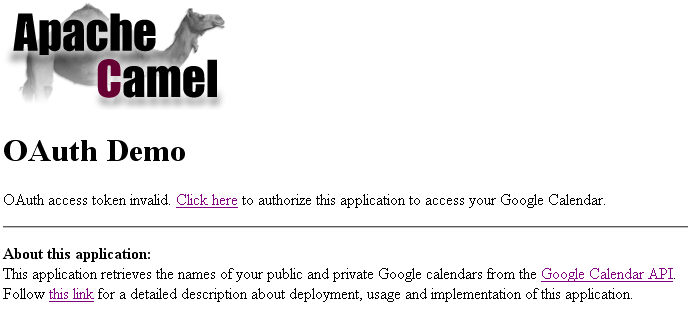

[[ConfluenceContent]]
[[Tutorial-OAuth-CamelOAuthTutorial]]
Camel OAuth Tutorial
~~~~~~~~~~~~~~~~~~~~

[[Tutorial-OAuth-Overview]]
Overview
^^^^^^^^

Goal of this tutorial is to demonstrate how to implement an
http://code.google.com/apis/accounts/docs/OAuth.html[OAuth] consumer
with Apache Camel. In this tutorial, the OAuth consumer is a simple web
application running on Google App Engine. It reads data from a user's
Google Calendar i.e. it displays the names of the user's public and
private calendars. The OAuth-based authorization process that allows the
application to access a user's calendars is implemented using Camel's
link:gauth.html[gauth] component. The application was accessible online
at http://gauthcloud.appspot.com/oauth/calendar (but not any more in
year 2015 onwards) (link:tutorial-oauth.html[later], it will be
explained how to build and deploy the application yourself). Play with
it by following these steps:

* Goto the application's main page at
http://gauthcloud.appspot.com/oauth/calendar (no longer online). If you
haven't used the application before, you'll see a message that no OAuth
access token is available. +
 +

* Follow the link next to this message to start the OAuth authorization
process. You will be redirected to Google Accounts. A message is shown
that a third party application is requesting access permissions. In
order to grant (or deny) access, login to your Google account. This step
may be skipped by Google if you already logged into Google Accounts
before. +
 +

* After login, Google displays a message that `gauthcloud.appspot.com`
wants to access your Google Calendar. Press the `Grant access` button to
continue. No worries, the sample application will only read the names of
your public and private Google calendars. No further reads or updates
are made to your calendars. If you don't want `gauthcloud.appspot.com`
to access your calendar, press `Deny access`. +
 +

* If you presses `Grant access`, Google redirects you back to the
application that now displays the names of your public and private
calendars. The following screenshot shows the list of
http://people.apache.org/~krasserm[my] calendars (some of them have
German names). Using OAUth, the web application gained access to your
calendar data without ever having seen your Google username and
password. These have been entered at a Google site directly. +
 +

* The result of a successful OAuth authorization process is an OAuth
access token that is issued to the web application. The application
stores this token for the duration of one hour. However, you can
invalidate the access token at any time by either following the link
below the calendar list or by going directly to
https://www.google.com/accounts/IssuedAuthSubTokens. This will display a
list of applications for which you granted access to your Google
account. Among these, there's also an entry for
`gauthcloud.appspot.com`. Click `Revoke Access` to invalidate the access
token immediately. +
 +

* If you go back to the application or reload the page with the calendar
list, a message is shown that the OAuth access token is invalid. Follow
the OAuth authorization process again to renew the token. +
 +

[Info]
====
 **Standalone web applications**

Camel's OAuth support is not limited to web applications running on
Google App Engine. It works for standalone web applications as well as
long as they are accessible from the internet so that Google can make
OAuth callbacks.

====

[[Tutorial-OAuth-Architecture]]
Architecture
^^^^^^^^^^^^

The following figure sketches the architcture of the distributed web
application and an example sequence of interactions.

[[Tutorial-OAuth-Applicationcomponents]]
Application components
++++++++++++++++++++++

[width="100%",cols="50%,50%",options="header",]
|=======================================================================
|Component |Description
|OAuth demo application |A Spring MVC-based web application with a
single controller (`TutorialController`) and a facade for accessing the
Google calendar service (`TutorialService`). The `TutorialController`
selects views for either displaying calendar data or error messages.

|OAuth integration layer |A Camel-based integration layer for doing all
the OAuth-specific interactions with Google Accounts.

|Google Accounts |The http://code.google.com/apis/accounts/[Google
Accounts] service.

|Google Calendar |The http://code.google.com/apis/calendar/[Google
Calendar] service.
|=======================================================================

[[Tutorial-OAuth-Sequenceofactions]]
Sequence of actions
+++++++++++++++++++

[width="100%",cols="50%,50%",options="header",]
|=======================================================================
|Step |Description
|1 |The user navigates to the main page of the demo application. The
`TutorialController` detects that there's no OAuth access token
available and renders a corresponding error message including a link for
initiating an OAuth authorization process. The link is targeted at an
HTTP endpoint implemented by the OAuth integration layer.

|2a |The user triggers the authorization process by following that link.

|2b |The integration layer obtains an unauthorized request token from
the Google Accounts API

|3 |It then redirects the user to a Google Accounts web page for login.

|4 |The user logs in and grants `gauthcloud.appspot.com` access to his
Google calendar.

|5a |Google redirects the user back to the OAUth integration layer
together with an authorized request token.

|5b |The integration layer upgrades the token to an OAuth access token
and stores this token in a cookie. The cookie expiration time is set to
one hour.

|6 |The user is redirected to the `TutorialController`.

|7a |The `TutorialController` can now obtain a valid access token from
the cookie and uses it to obtain the user's calendar data (via the
`TutorialService`).

|7b |After having obtained the calendar data, the `TutorialController`
selects a view for rendering the list of calendar names.
|=======================================================================

[Note]
====
 **Storage of access tokens**

In production systems it is *not* recommended to store access tokens in
cookies. The recommended approach is to store them in a database. The
demo application is only doing that to keep the example as simple as
possible. However, an attacker could not use an access token alone to
get access to a user's calendar data because the application's consumer
secret is necessary for that as well. The consumer secret never leaves
the demo application.

====

[[Tutorial-OAuth-Deployment]]
Deployment
^^^^^^^^^^

This section explains how to build and deploy the web application
yourself.

[[Tutorial-OAuth-Prerequisites]]
Prerequisites
+++++++++++++

* https://appengine.google.com/[Sign up] for a Google App Engine account
if you don't have one.
* Create a new application via the https://appengine.google.com/[admin
console] or reuse an existing one for uploading the example.
* Optional:
http://code.google.com/apis/accounts/docs/RegistrationForWebAppsAuto.html[register]
the application for use with Google's OAuth. After registration you
should have access to a _consumer key_ and a _consumer secret_. If you
decide not to register your application, use `anonymous` for the
consumer key and the consumer secret. In this case Google will display a
warning message on the authorization page which is acceptable for
testing-purposes.
* Install the http://code.google.com/appengine/downloads.html[Google App
Engine SDK for Java]. This tutorial has been tested with version 1.3.6.

[[Tutorial-OAuth-Buildfromsources]]
Build from sources
++++++++++++++++++

Checkout the sources with

....
svn co http://svn.apache.org/repos/asf/camel/trunk/examples/camel-example-gauth camel-example-gauth
....

Open `camel-example-gauth/pom.xml` file and define values for the
application properties e.g.

*pom.xml*

[source,brush:,java;,gutter:,false;,theme:,Default]
----
<project xmlns="http://maven.apache.org/POM/4.0.0" 
  xmlns:xsi="http://www.w3.org/2001/XMLSchema-instance" 
  xsi:schemaLocation="http://maven.apache.org/POM/4.0.0 http://maven.apache.org/maven-v4_0_0.xsd">

    ...
    <properties>
        <!-- application properties -->
        <gae.application.name>gauthclaud</gae.application.name>
        <gae.consumer.key>gauthcloud.appspot.com</gae.consumer.key>
        <gae.consumer.secret>g2e...ue</gae.consumer.secret>
        ...
    </properties>
    ...

</project>
----

or

*pom.xml*

[source,brush:,java;,gutter:,false;,theme:,Default]
----
<project xmlns="http://maven.apache.org/POM/4.0.0" 
  xmlns:xsi="http://www.w3.org/2001/XMLSchema-instance" 
  xsi:schemaLocation="http://maven.apache.org/POM/4.0.0 http://maven.apache.org/maven-v4_0_0.xsd">

    ...
    <properties>
        <!-- application properties -->
        <gae.application.name>gauthclaud</gae.application.name>
        <gae.consumer.key>anonymous</gae.consumer.key>
        <gae.consumer.secret>anonymous</gae.consumer.secret>
        ...
    </properties>
    ...

</project>
----

if you don't want to register your application. Then go to the
`camel-example-gauth` directory and enter

....
mvn install
....

This will create the application `war` file in the target directory.

[[Tutorial-OAuth-DeploytoAppengine]]
Deploy to Appengine
+++++++++++++++++++

Finally use the `appcfg` command-line tool of the App Engine SDK to
deploy the application.

....
appcfg update target/camel-example-gauth-<version>
....

where `version` needs to be replaced with the version of Camel you're
using. You will be prompted for the email address and password of your
Google App Engine account. After deployment the example application is
ready to use.

[Note]
====
 **Potential issue when using appcfg from the GAE SDK**

It is important that you run `appcfg` with a `java` executable that is
part of a JDK. If it is part of a JRE only then JSP compilation won't
work. This is explained on the
http://groups.google.com/group/google-appengine-java/msg/9b2f85fdff04c5ef[appengine-java
mailing list]. Editing `appcfg.sh` or `appcfg.cmd` and pointing to an
appropriate `java` executable should do the trick.

====

[[Tutorial-OAuth-Codewalkthrough]]
Code walkthrough
^^^^^^^^^^^^^^^^

[[Tutorial-OAuth-Applicationcontroller]]
Application controller
++++++++++++++++++++++

Entry point to the demo application is the `TutorialController`. It
tries to obtain an OAuth access token from a cookie and interacts with
the `TutorialService` for getting a user's calendar data from the Google
Calendar API. Error messages (authentication failures) are displayed to
the user by selecting the `authorize.jsp` view. This view also contains
a link for starting the OAuth authorization process as shown above. A
list of calendar names is displayed to the user by selecting the
`calendar.jsp` view.

*TutorialController.java*

[source,brush:,java;,gutter:,false;,theme:,Default]
----
package org.apache.camel.example.gauth;

import java.util.List;
import javax.servlet.http.Cookie;
import javax.servlet.http.HttpServletRequest;
import javax.servlet.http.HttpServletResponse;

import com.google.gdata.util.AuthenticationException;
import org.springframework.beans.factory.annotation.Autowired;
import org.springframework.stereotype.Controller;
import org.springframework.ui.ModelMap;
import org.springframework.web.bind.annotation.RequestMapping;
import org.springframework.web.bind.annotation.RequestMethod;

/**
 * Single controller for the demo application that handles GET requests. Obtains OAuth access
 * token and access token secret from cookies and uses them to obtain calendar names from the
 * Google Calendar API. If the interaction with the calendar API fails due to invalid or non-
 * existing OAuth tokens an error message is displayed in authorize.jsp. If it succeeds the
 * calendar names are displayed in calendar.jsp.
 * 

 * In production systems it is <em>not</em> recommended to store access tokens in cookies. The
 * recommended approach is to store them in a database. The demo application is only doing that
 * to keep the example as simple as possible. However, an attacker could not use an access token
 * alone to get access to a user's calendar data because the application's consumer secret is
 * necessary for that as well. The consumer secret never leaves the demo application.
 */
@Controller
@RequestMapping("/calendar")
public class TutorialController {

    @Autowired
    private TutorialService service;
    
    @SuppressWarnings("unchecked")
    @RequestMapping(method = RequestMethod.GET)
    public String handleGet(
            HttpServletRequest request, 
            HttpServletResponse response, 
            ModelMap model) throws Exception {

        List<String> calendarNames = null;

        // Get OAuth tokens from cookies
        String accessToken = getAccessToken(request);
        String accessTokenSecret = getAccessTokenSecret(request);
        
        if (accessToken == null) {
            model.put("message", "No OAuth access token available");
            return "/WEB-INF/jsp/authorize.jsp";
        }
        
        try {
            // Get calendar names from Google Calendar API
            calendarNames = service.getCalendarNames(accessToken, accessTokenSecret);
        } catch (AuthenticationException e) {
            model.put("message", "OAuth access token invalid");
            return "/WEB-INF/jsp/authorize.jsp";
        }
        
        model.put("calendarNames", calendarNames);
        return "/WEB-INF/jsp/calendar.jsp";        
    }
    
    private static String getAccessToken(HttpServletRequest request) {
        return getCookieValue(request.getCookies(), "TUTORIAL-ACCESS-TOKEN");
    }
    
    private static String getAccessTokenSecret(HttpServletRequest request) {
        return getCookieValue(request.getCookies(), "TUTORIAL-ACCESS-TOKEN-SECRET");
    }

    // rest of code not shown ...
    
}
----

[[Tutorial-OAuth-Applicationservice]]
Application service
+++++++++++++++++++

Access to the Google Calendar API is encapsulated in the
`TutorialService` class. It uses Google's
http://code.google.com/p/gdata-java-client/[GData client library] for
abstracting from low-level protocol details. The `getCalendarNames`
method is paramterized with an OAuth access token and access token
secret. If the access token is invalid then an `AuthenticationException`
is thrown by the GData client. The exception is handled by the
`TutorialController`.

*TutorialService.java*

[source,brush:,java;,gutter:,false;,theme:,Default]
----
package org.apache.camel.example.gauth;

import java.net.URL;
import java.util.ArrayList;
import java.util.List;
import java.util.Properties;

import com.google.gdata.client.authn.oauth.OAuthHmacSha1Signer;
import com.google.gdata.client.authn.oauth.OAuthParameters;
import com.google.gdata.client.calendar.CalendarService;
import com.google.gdata.data.calendar.CalendarEntry;
import com.google.gdata.data.calendar.CalendarFeed;

/**
 * Facade for getting calendar names from the Google Calendar API. The access is made on
 * behalf of a user by providing an OAuth access token and access token secret.
 */
public class TutorialService {

    private Properties credentials;

    /**
     * Sets properties that contains the application's consumer key and consumer secret.
     *
     * @param credentials consumer key and consumer secret.
     */
    public void setCredentials(Properties credentials) {
        this.credentials = credentials;
    }

    /**
     * Obtains a list of names of a user's public and private calendars from the Google
     * Calendar API.
     * 
     * @param accessToken OAuth access token.
     * @param accessTokenSecret OAuth access token secret.
     * @return list of names of a user's public and private calendars.
     */
    public List<String> getCalendarNames(String accessToken, String accessTokenSecret) throws Exception {
        CalendarService calendarService = new CalendarService("apache-camel-2.3"); 
        OAuthParameters params = getOAuthParams(accessToken, accessTokenSecret);
        calendarService.setOAuthCredentials(params, new OAuthHmacSha1Signer());
        URL feedUrl = new URL("http://www.google.com/calendar/feeds/default/");
        CalendarFeed resultFeed = calendarService.getFeed(feedUrl, CalendarFeed.class);

        ArrayList<String> result = new ArrayList<String>();
        for (int i = 0; i < resultFeed.getEntries().size(); i++) {
            CalendarEntry entry = resultFeed.getEntries().get(i);
            result.add(entry.getTitle().getPlainText());
        }
        return result;
    }
    
    private OAuthParameters getOAuthParams(String accessToken, String accessTokenSecret) {
        OAuthParameters params = new OAuthParameters();
        params.setOAuthConsumerKey(credentials.getProperty("consumer.key"));
        params.setOAuthConsumerSecret(credentials.getProperty("consumer.secret"));
        params.setOAuthToken(accessToken);
        params.setOAuthTokenSecret(accessTokenSecret);
        return params;
    }
    
}
----

The

[[Tutorial-OAuth-Integrationlayer]]
Integration layer
+++++++++++++++++

The integration layer uses Camel's link:gauth.html[gauth] component to
implement the consumer part of the OAuth authorization process. It
cleanly separates OAuth integration logic from other parts of the
application and is implemented by the `TutorialRouteBuilder` class.

*TutorialRouteBuilder.java*

[source,brush:,java;,gutter:,false;,theme:,Default]
----
package org.apache.camel.example.gauth;

import java.net.URLEncoder;

import org.apache.camel.builder.RouteBuilder;

/**
 * Builds the OAuth-specific routes (implements the OAuth integration layer) of the demo application.
 */
public class TutorialRouteBuilder extends RouteBuilder {

    private String application;

    /**
     * Sets the name of the GAE application.
     *
     * @param application a GAE application name.
     */
    public void setApplication(String application) {
        this.application = application;
    }

    @Override
    public void configure() throws Exception {

        // Callback URL for sending back an authorized access token.
        String encodedCallback = URLEncoder.encode(
            String.format("https://%s.appspot.com/camel/handler", application), "UTF-8");

        // Google should issue an access token that is scoped to calendar feeds.
        String encodedScope = URLEncoder.encode("http://www.google.com/calendar/feeds/", "UTF-8");

        // Route for obtaining an unauthorized request token from Google Accounts. The
        // response redirects the browser to an authorization page provided by Google.
        from("ghttp:///authorize")
            .to("gauth:authorize?callback=" + encodedCallback + "&scope=" + encodedScope);

        
        // Handles callbacks from Google Accounts which contain an authorized request token.
        // The authorized request token is upgraded to an access token which is stored in
        // the response message header. The TutorialTokenProcessor is application-specific
        // and stores the access token (plus access token secret) is cookies. It further
        // redirects the user to the application's main location (/oauth/calendar).
        from("ghttp:///handler")
            .to("gauth:upgrade")
            .process(new TutorialTokenProcessor());
    }

}
----

This class implements two routes:

1.  The first route obtains an unauthorized access token from Google
Accounts and redirects the user to an authorization page provided by
Google.
2.  The second route handles OAuth callbacks from Google and upgrades an
authorized request tokens to access tokens.

The last step in the second route is an application-specific processor
(`TutorialTokenProcessor`) that stores the access token in a cookie and
redirects the user to the main page of the demo application (which is
served by the `TutorialController`).

*TutorialTokenProcessor.java*

[source,brush:,java;,gutter:,false;,theme:,Default]
----
package org.apache.camel.example.gauth;

import javax.servlet.http.Cookie;
import javax.servlet.http.HttpServletResponse;

import org.apache.camel.Exchange;
import org.apache.camel.Processor;

import static org.apache.camel.component.gae.auth.GAuthUpgradeBinding.GAUTH_ACCESS_TOKEN;
import static org.apache.camel.component.gae.auth.GAuthUpgradeBinding.GAUTH_ACCESS_TOKEN_SECRET;

/**
 * Reads an OAuth access token plus access token secret from a Camel message and stores them in
 * cookies. These cookies are needed by {@link org.apache.camel.example.gauth.TutorialController}
 * for accessing a user's calendar via the Google Calendar API. The cookies are valid for one
 * hour. Finally, it generates an HTTP 302 response that redirects the user to the application's
 * main location (/oauth/calendar).
 * 

 * In production systems it is <em>not</em> recommended to store access tokens in cookies. The 
 * recommended approach is to store them in a database. The demo application is only doing that
 * to keep the example as simple as possible. However, an attacker could not use an access token
 * alone to get access to a user's calendar data because the application's consumer secret is
 * necessary for that as well. The consumer secret never leaves the demo application.
 */
public class TutorialTokenProcessor implements Processor {

    private static final int ONE_HOUR = 3600;
    
    public void process(Exchange exchange) throws Exception {
        String accessToken = exchange.getIn().getHeader(GAUTH_ACCESS_TOKEN, String.class);
        String accessTokenSecret = exchange.getIn().getHeader(GAUTH_ACCESS_TOKEN_SECRET, String.class);
    
        if (accessToken != null) {
            HttpServletResponse servletResponse = exchange.getIn().getHeader(
                    Exchange.HTTP_SERVLET_RESPONSE, HttpServletResponse.class);
            
            Cookie accessTokenCookie = new Cookie("TUTORIAL-ACCESS-TOKEN", accessToken);
            Cookie accessTokenSecretCookie = new Cookie("TUTORIAL-ACCESS-TOKEN-SECRET", accessTokenSecret); 
            
            accessTokenCookie.setPath("/oauth/");
            accessTokenCookie.setMaxAge(ONE_HOUR);
            
            accessTokenSecretCookie.setPath("/oauth/");
            accessTokenSecretCookie.setMaxAge(ONE_HOUR);
            
            servletResponse.addCookie(accessTokenCookie);
            servletResponse.addCookie(accessTokenSecretCookie);
        }
        
        exchange.getOut().setHeader(Exchange.HTTP_RESPONSE_CODE, 302);
        exchange.getOut().setHeader("Location", "/oauth/calendar");
    }

}
----

For further details about implementing OAuth integration layers in web
application refer to the link:gauth.html[gauth] component documentation.

[[Tutorial-OAuth-Configuration]]
Configuration
+++++++++++++

The `TutorialController` and `TutorialService` are set up in their own
Spring application context. The `TutorialController` is scanned from the
classpath using Spring's `<ctx:component-scan>` element. It is an
http://static.springsource.org/spring/docs/2.5.x/reference/mvc.html#mvc-annotation[annotation-based
Spring MVC controller].

*context-web.xml*

[source,brush:,java;,gutter:,false;,theme:,Default]
----
<beans xmlns="http://www.springframework.org/schema/beans"
    xmlns:xsi="http://www.w3.org/2001/XMLSchema-instance"
    xmlns:ctx="http://www.springframework.org/schema/context"
    xmlns:util="http://www.springframework.org/schema/util"
    xsi:schemaLocation="
http://www.springframework.org/schema/beans 
http://www.springframework.org/schema/beans/spring-beans-2.5.xsd
http://www.springframework.org/schema/context 
http://www.springframework.org/schema/context/spring-context-2.5.xsd
http://www.springframework.org/schema/util
http://www.springframework.org/schema/util/spring-util-2.5.xsd">

    <ctx:component-scan base-package="org.apache.camel.example.gauth"/>

    <util:properties id="credentials" location="classpath:context.properties"/>
        
    <bean id="tutorialService" class="org.apache.camel.example.gauth.TutorialService">
        <property name="credentials" ref="credentials" />
    </bean>
    
</beans>
----

The integration layer and its `CamelContext` is configured in
`context-camel.xml`. This application context also configures the
link:gauth.html[gauth] component with an application specific consumer
key and consumer secret. These are read from a `context.properties`
file.

*context-camel.xml*

[source,brush:,java;,gutter:,false;,theme:,Default]
----
<beans xmlns="http://www.springframework.org/schema/beans"
       xmlns:xsi="http://www.w3.org/2001/XMLSchema-instance"
       xmlns:context="http://www.springframework.org/schema/context"
       xmlns:camel="http://camel.apache.org/schema/spring"
       xsi:schemaLocation="
http://www.springframework.org/schema/beans 
http://www.springframework.org/schema/beans/spring-beans-2.5.xsd
http://www.springframework.org/schema/context
http://www.springframework.org/schema/context/spring-context-2.5.xsd
http://camel.apache.org/schema/spring
http://camel.apache.org/schema/spring/camel-spring.xsd">
    
    <context:property-placeholder location="classpath:context.properties"/>
    
    <camel:camelContext id="camelContext">
        <camel:jmxAgent id="agent" disabled="true" />
        <camel:routeBuilder ref="tutorialRouteBuilder"/>
    </camel:camelContext>
    
    <bean id="tutorialRouteBuilder" 
        class="org.apache.camel.example.gauth.TutorialRouteBuilder">
        <property name="application" value="${application.name}" />
    </bean>
    
    <bean id="gauth" class="org.apache.camel.component.gae.auth.GAuthComponent">
        <property name="consumerKey" value="${consumer.key}" />
        <property name="consumerSecret" value="${consumer.secret}" />
    </bean>
    
</beans>
----

Both application contexts are referenced in the application's `web.xml`.

*web.xml*

[source,brush:,java;,gutter:,false;,theme:,Default]
----
<web-app 
xmlns="http://java.sun.com/xml/ns/javaee"
xmlns:xsi="http://www.w3.org/2001/XMLSchema-instance"
xmlns:web="http://java.sun.com/xml/ns/javaee/web-app_2_5.xsd"
xsi:schemaLocation="
http://java.sun.com/xml/ns/javaee
http://java.sun.com/xml/ns/javaee/web-app_2_5.xsd" version="2.5">
    
    <servlet>
        <servlet-name>CamelServlet</servlet-name>
        <servlet-class>org.apache.camel.component.servlet.CamelHttpTransportServlet</servlet-class>
        <init-param>
            <param-name>contextConfigLocation</param-name>
            <param-value>context-camel.xml</param-value>
        </init-param>
    </servlet>

    <servlet>
        <servlet-name>oauth</servlet-name>
        <servlet-class>org.springframework.web.servlet.DispatcherServlet</servlet-class>
        <init-param>
            <param-name>contextConfigLocation</param-name>
            <param-value>/WEB-INF/classes/context-web.xml</param-value>
        </init-param>       
    </servlet>
    
    <servlet-mapping>
        <servlet-name>oauth</servlet-name>
        <url-pattern>/oauth/*</url-pattern>
    </servlet-mapping>
    <servlet-mapping>
        <servlet-name>CamelServlet</servlet-name>
        <url-pattern>/camel/*</url-pattern>
    </servlet-mapping>
    
</web-app>
----
