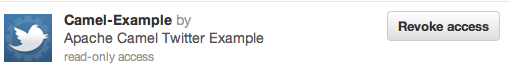
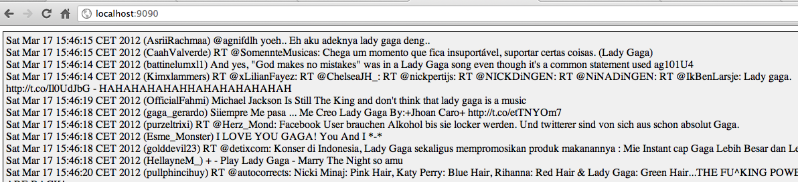

[[ConfluenceContent]]
[[TwitterWebsocketExample-TwitterWebsocketExample]]
Twitter Websocket Example
~~~~~~~~~~~~~~~~~~~~~~~~~

*Available as of Camel 2.10*

This example is located in the Camel link:download.html[distribution] at
`examples/camel-example-twitter-websocket`.

[Tip]
====

There is a link:twitter-websocket-blueprint-example.html[Twitter
Websocket Blueprint Example] for OSGi Blueprint users.

====

The example is demonstrating how to poll a constant feed of twitter
searches and publish results in real time using web socket to a web
page. +
As usual the code in Camel is very simple. All it takes is roughly

[source,brush:,java;,gutter:,false;,theme:,Default]
----
  from("twitter://search?...")
    .to("websocket:camel-tweet?sendToAll=true")
----

This example is already configured using a testing purpose twitter
account named 'cameltweet'. And therefore the example is ready to run
out of the box.

This account is only for testing purpose, and should *not* be used in
your custom applications. For that you need to setup and use your own
twitter account.

[Info]
====
 **How to use my own twitter account**

To use twitter, you need a twitter account which have setup an
https://apps.twitter.com/[application] to be used. +
For twitter users, you may be familiar that twitter requires you to
grant applications access to your twitter account, such as twitter for
iphone etc. +
The same applies for this example. You can read details about how to
setup a new twitter application at the Camel link:twitter.html[Twitter]
documentation.

In your Twitter settings under the Apps menu, it will list your approved
applications. For example I created an application named
"Camel-Example" +
which is now listed as approved with read-only access. +

When you have created an application, you get a number of details back
from twitter +
which you need to use the twitter component. Enter these details in the
source code at: +
`src/main/java/org/apache/camel/example/websocket/CamelTwitterWebSocketMain.java`

====

You will need to compile this example first:

[source,brush:,java;,gutter:,false;,theme:,Default]
----
mvn compile
----

To run the example type

[source,brush:,java;,gutter:,false;,theme:,Default]
----
mvn exec:java
----

Then open a browser to see live twitter updates in the webpage

[source,brush:,java;,gutter:,false;,theme:,Default]
----
http://localhost:9090/index.html
----

To stop the example hit ctrl + c

When the application runs, the webpage should automatic update with new
tweets. A screenshot below illustrates what you would see: +

[[TwitterWebsocketExample-Seealso]]
See also
^^^^^^^^

* link:twitter-websocket-blueprint-example.html[Twitter Websocket
Blueprint Example]
* link:twitter.html[Twitter]
* link:websocket.html[Websocket]
* link:examples.html[Examples]
* link:tutorials.html[Tutorials]
* link:user-guide.html[User Guide]
