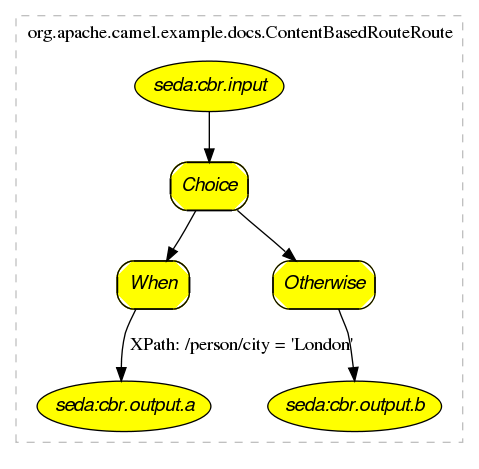

[[ConfluenceContent]]
[[Visualisation-Visualisation]]
Visualisation
~~~~~~~~~~~~~

[Warning]
====

This functionality is deprecated and to be removed in future Camel
releases.

====

 

Camel supports the visualisation of your
link:enterprise-integration-patterns.html[Enterprise Integration
Patterns] using the http://graphviz.org[GraphViz] DOT files which can
either be rendered directly via a suitable GraphViz tool or turned into
HTML, PNG or SVG files via the link:camel-maven-plugin.html[Camel Maven
Plugin].

Here is a
http://activemq.apache.org/camel/maven/camel-spring/cameldoc/index.html[typical
example] of the kind of thing we can generate

If you click on
http://activemq.apache.org/camel/maven/examples/camel-example-docs/cameldoc/main/routes.html[the
actual generated html]you will see that you can navigate from an EIP
node to its pattern page, along with getting hover-over tool tips ec.

[[Visualisation-Howtogenerate]]
How to generate
^^^^^^^^^^^^^^^

See link:camel-dot-maven-goal.html[Camel Dot Maven Goal] or the other
maven goals link:camel-maven-plugin.html[Camel Maven Plugin]

[[Visualisation-ForOSXusers]]
For OS X users
^^^^^^^^^^^^^^

If you are using OS X then you can open the DOT file using
http://www.pixelglow.com/graphviz/[graphviz] which will then
automatically re-render if it changes, so you end up with a real time
graphical representation of the topic and queue hierarchies!

Also if you want to edit the layout a little before adding it to a wiki
to distribute to your team, open the DOT file with
http://www.omnigroup.com/applications/omnigraffle/[OmniGraffle] then
just edit away
image:https://cwiki.apache.org/confluence/s/en_GB/5997/6f42626d00e36f53fe51440403446ca61552e2a2.1/_/images/icons/emoticons/smile.png[(smile)]
